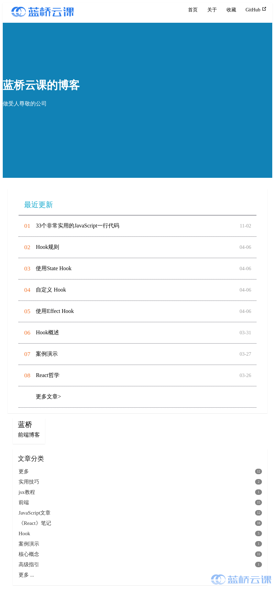
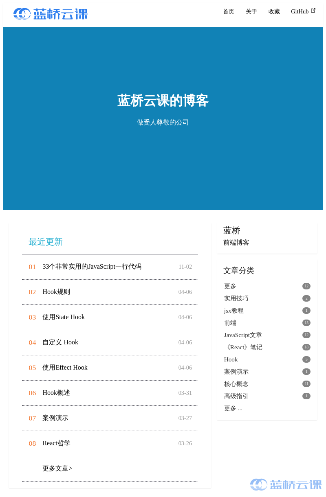

# 【页面布局】个人博客

## 背景介绍

很多人都有自己的博客，在博客上面用自己的方式去书写文章，用来记录生活，分享技术等。下面是蓝桥云课的博客，但是上面还缺少一些样式，需要大家去完善。

## 准备步骤

在开始答题前，你需要在线上环境终端中键入以下命令，下载并解压所提供的文件。

```bash
wget https://labfile.oss.aliyuncs.com/courses/7835/blog.zip&& unzip blog.zip && rm blog.zip
```

下载完成之后的目录结构如下：

```txt
├── index.css
└── index.html
└── logo.svg
```

其中：

- `index.css` 是本次挑战需要补充样式的文件。
- `index.html` 是博客页面。
- `logo.svg` 是 logo 图片.

你可以参考下图中的步骤访问项目：

1. 选中 index.html 右键启动 Web Server 服务（Open with Live Server），让项目运行起来。
2. 打开环境右侧的【Web 服务】，就可以在浏览器中看到未完成的博客页面。




## 考试要求

<div class="alert alert-success">

1. 在 `index.css` 中已经给出了修改部分的提示，请仔细阅读。
2. 请完善 `index.css` 上方需要修改的代码，修改完成后，页面效果如下所示：



</div>

## 要求规定

- 请严格按照考试步骤操作，切勿修改考试默认提供项目中的文件名称、文件夹路径等。
- 满足题目需求后，保持 Web 服务处于可以正常访问状态，点击「提交检测」系统会自动判分。
