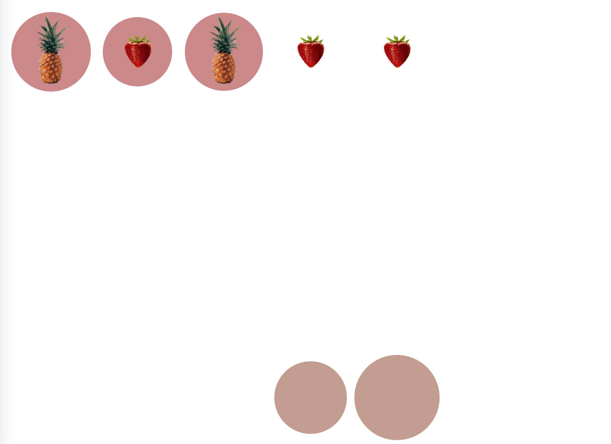
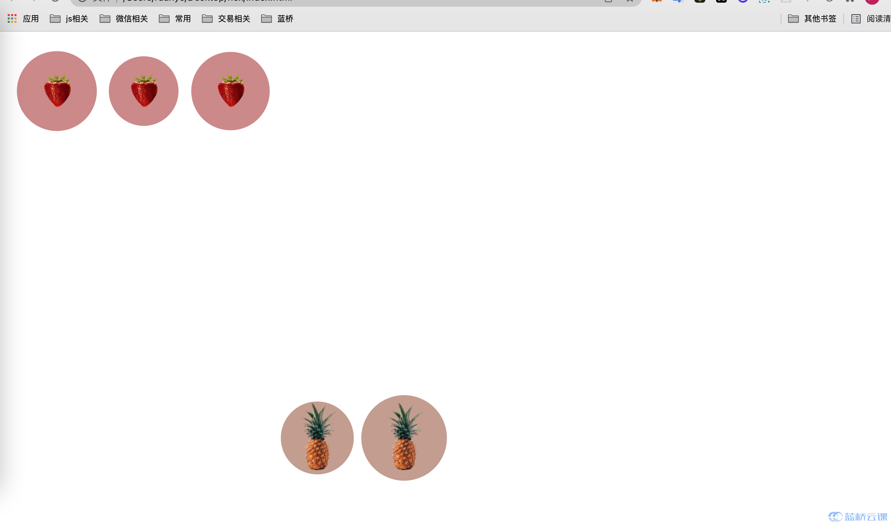

# 【页面布局】 水果摆盘

## 背景介绍

目前 CSS3 中新增的 Flex 弹性布局已经成为前端页面布局的首选方式，这次试题将利用 Flex 实现经典布局效果。

## 准备步骤

在开始答题前，你需要在线上环境终端中键入以下命令，下载并解压所提供的文件。

```bash
wget https://labfile.oss.aliyuncs.com/courses/7835/fruit-flex.zip&& unzip fruit-flex.zip && rm fruit-flex.zip
```

下载完成之后的目录结构如下：

```txt
├── index.css
└── index.html
└── img
```

其中：

- `index.css` 是本次挑战的需要补充样式文件。
- `index.html` 为主页面。
- `img` 图片文件夹。

1. 选中 index.html 右键启动 Web Server 服务（Open with Live Server），让项目运行起来。
2. 打开环境右侧的【Web 服务】。




## 考试要求

<div class="alert alert-success">

#### 提示

```txt
align-self 值 ：
  flex-start flex-end center baseline stretch

order:<整数>(... -1, 0 (default), 1, ..)
```

在需要修改部分的代码有相关提示，请仔细阅读之后，使用 flex 布局中的 `align-self` 和 `order` 完善 `index.css` 中的代码， 把对应的水果放在对应的盘子里面，最终效果如下：



</div>

## 要求规定

- 请严格按照考试步骤操作，切勿修改考试默认提供项目中的文件名称、文件夹路径等。
- 满足题目需求后，保持 Web 服务处于可以正常访问状态，点击「提交检测」系统会自动判分。
