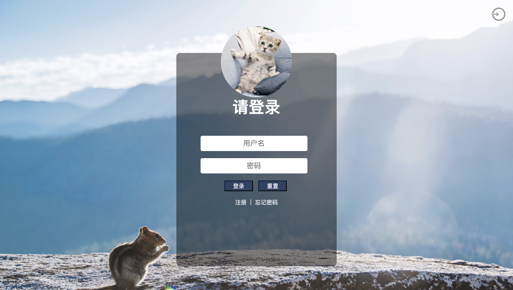

# 【页面布局】给页面化个妆

## 背景介绍

各个网站都拥有登录页面，设计一个界面美观的登录页面，会给用户带来视觉上的享受。本次试题我们要完成一个登录页面的布局。

## 准备步骤

在开始答题前，你需要在线上环境终端中键入以下命令，下载并解压所提供的文件。

```bash
wget https://labfile.oss.aliyuncs.com/courses/7835/exam01-imi.zip && unzip exam01-imi.zip && mv exam01-imi/* ./ && rm -rf exam01-imi*
```

下载完成之后的目录结构如下：

```txt
├── css
│   └── style.css
├── images
│   ├── background-pic.jpeg
│   ├── cat.png
│   └── icon.png
└── index.html
```

其中：

- `css/style.css` 是本次挑战需补充的样式文件。
- `images` 是项目所用到的图片文件。
- `index.html` 是登录页面。

1. 下载源码。
2. 选中 `index.html` 右键启动 Web Server 服务（Open with Live Server），让项目运行起来。
3. 打开环境右侧的【Web 服务】，就可以在浏览器中看到未完成的登录页面布局。



## 考试要求

<div class="alert alert-success">

请完善 `css/style.css` 样式文件，让登录页面呈现如下所示的效果：


页面关键样式说明如下：

- 表单外观样式：高为 `600px`、宽为 `450px`、背景颜色为 `rgba(0, 0, 0, .45)`、圆角边框为 `10px`。
- 表单顶部的头像图片样式：宽和高均为 `200px`、圆角 `50%`。
- 表单中的二级标题样式：字体大小为 `45px`、字体粗细为 `800`。
- 表单中按钮样式：宽为 `80px`、高为 `30px`、边框颜色为 `#041c32`、背景颜色为 `#2d4263`、字体大小为 `16px`、字体颜色为 `white`。
- 表单中输入框的样式：字体大小为 `20px`、圆角边框为 `5px`、宽度为 `300px`。

</div>

## 要求规定

- 请严格按照考试步骤操作，切勿修改考试默认提供项目中的文件名称、文件夹路径等。
- 满足题目需求后，保持 Web 服务处于可以正常访问状态，点击「提交检测」系统会自动判分。

