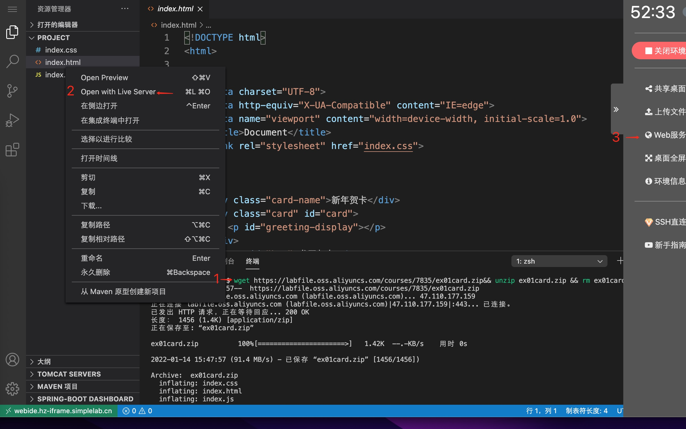
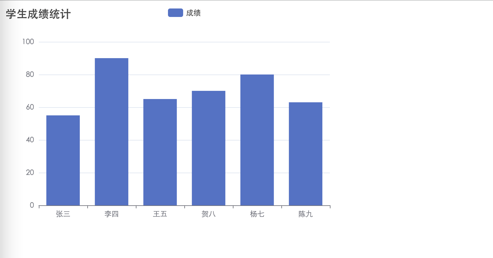

# echarts 柱形图

## 背景介绍

随着大数据的发展，数据统计在很多应用中显得不可或缺，echarts 作为一款基于 JavaScript 的数据可视化图表库，也成为了前端开发的必备技能，下面我们一起来用 echarts 开发一个学生数据统计的柱形图。

## 准备步骤

在开始答题前，你需要在线上环境终端中键入以下命令，下载并解压所提供的文件。

```bash
wget https://labfile.oss.aliyuncs.com/courses/7835/echarts.zip && unzip echarts.zip && rm echarts.zip
```

下载完成之后的目录结构如下：

```txt
├── echarts.js
└── index.html
```

你可以参考下图中的步骤访问项目：

1. 选中 index.html 右键启动 Web Server 服务（Open with Live Server），让项目运行起来。
2. 打开环境右侧的【Web 服务】。



打开控制台，我们会发下如下报错：



在 echars 图标中，x 轴和 y 轴无论存不存在数据都必须要定义。这个报错主要是因为没有定义 x 轴引起的。

## 考试要求

<div class="alert alert-success">

1. 在需要修改的地方，有详细的注释，请仔细阅读。
2. 修复项目中的报错，并让让统计图表按照正确的方向显示（提示：x 轴的写法请参照 y 轴）。修改 `index.html`中的 js 部分，效果如下：


</div>

## 要求规定

- 请严格按照考试步骤操作，切勿修改考试默认提供项目中的文件名称、文件夹路径等。
- 满足题目需求后，保持 Web 服务处于可以正常访问状态，点击「提交检测」系统会自动判分。
