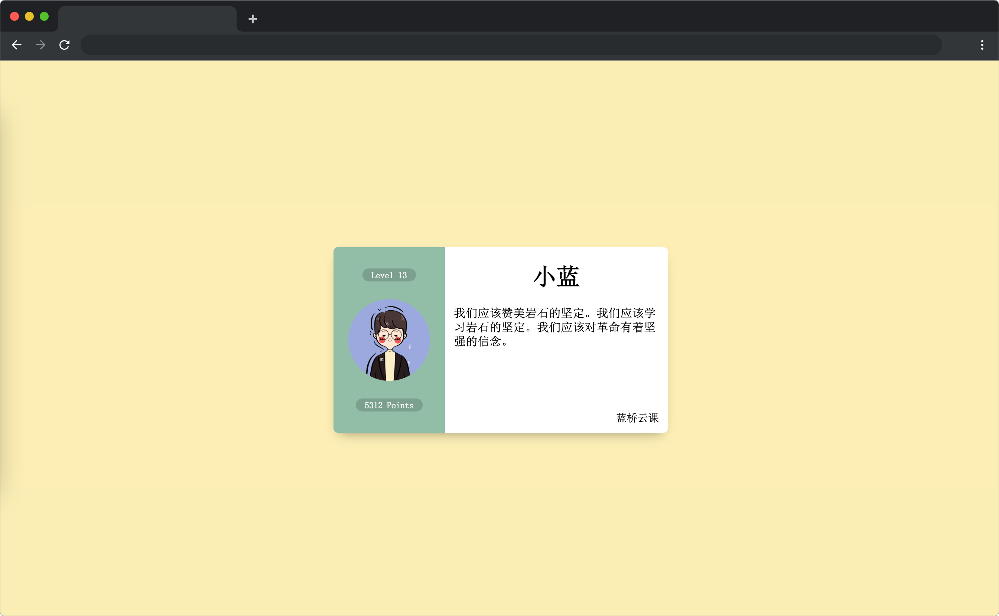

# 用户名片

## 介绍

CSS 样式是前端开发的必备技能之一，下面请用你丰富的经验帮小蓝完成一个漂亮的用户名片制作吧。

## 准备

本题已经内置了初始代码，打开实验环境，目录结构如下：

```txt
├── css
│   └── style.css
├── images
└── index.html
```

其中：

- `css/style.css` 是样式文件。
- `images` 是页面布局需要用到的图片素材。
- `index.html` 是主页面。

选中 `index.html` 右键启动 Web Server 服务（Open with Live Server），让项目运行起来。

接着，打开环境右侧的【Web 服务】，就可以在浏览器中看到如下效果：



## 目标

请通过补充或者修改 `css/style.css` 中的样式（注意：不要修改元素大小），达到以下效果：

1. 实现卡片（`class = card`） 和用户头像（`class = avatar`） 元素水平垂直居中。
2. 左侧文字（`class = level` 和 `class = points`）水平居中。

完成后，最终页面效果如下：


## 规定

- 请勿修改已经提供的代码，以免造成判题无法通过。
- 请严格按照考试步骤操作，切勿修改考试默认提供项目中的文件名称、文件夹路径等。
- 满足题目需求后，保持 Web 服务处于可以正常访问状态，点击「提交检测」系统会自动判分

## 判分标准

- 本题完全实现题目目标得满分，否则得 0 分。
