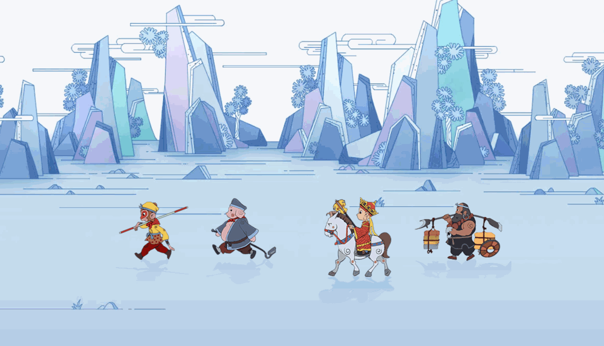

# 西游记之西天取经

## 介绍

师徒四人一行向西天拜佛求经，不料中途被妖怪施了法术动弹不得！俗话说救人一命胜造七级浮屠！情急之下小蓝挺身而出，灵机一动，用 `css` 行善施救，让师徒西行而去，从而普渡众生，善哉，善哉！

## 准备

本题已经内置了初始代码，打开实验环境，目录结构如下：

```txt

├── images 
│   ├── background.webp
│   ├── west_01.png
│   ├── west_02.png
│   ├── west_03.png 
│   └── west_04.png
└── index.html
```

其中：

- `index.html` 是主页面。
- `images` 是图片文件夹。

注意：打开环境后发现缺少项目代码，请复制下述命令至命令行进行下载。

```bash
wget https://labfile.oss.aliyuncs.com/courses/18164/The_journey_to_the_West.zip && unzip The_journey_to_the_West.zip && rm The_journey_to_the_West.zip
```

在浏览器中预览 `index.html` 页面初始化后动画只动一次就会停下来。页面效果如下：




## 目标

  - 完成 `index.html` 中的 TODO 部分，完成后让动画无限循环起来，效果如下:


 图片素材来源于网络，版权归原作者所有。

## 规定

- 请严格按照考试步骤操作，切勿修改考试默认提供项目中的文件名称、文件夹路径、class 名、id 名、图片名等，以免造成无法判题通过。
- 满足需求后，保持 Web 服务处于可以正常访问状态，点击「提交检测」系统会自动检测。

## 判分标准

- 本题完全实现题目目标得满分，否则得 0 分。
