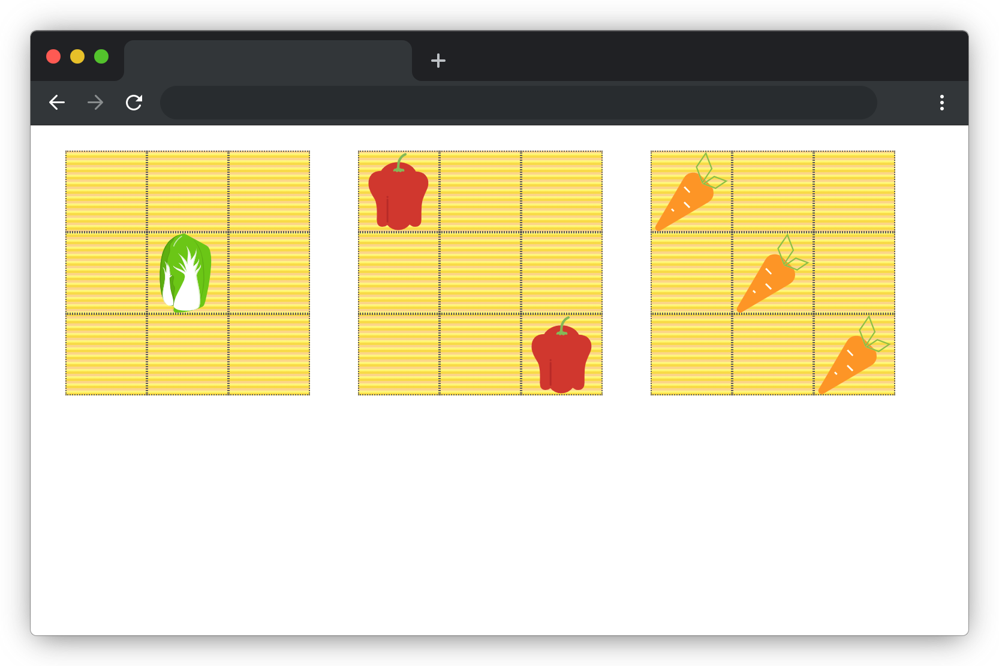

# 新鲜的蔬菜

## 介绍

厨房里新到一批蔬菜，被凌乱地堆放在一起，现在我们给蔬菜分下类，把相同的蔬菜放到同一个菜板上，拿给厨师烹饪美味佳肴吧。

## 准备

开始答题前，需要先打开本题的项目代码文件夹，目录结构如下：

```txt
├── css
│   └── style.css
├── images
└── index.html
```

其中：

- `css/style.css` 是需要补充代码的样式文件。
- `images` 是图片文件夹。
- `index.html` 是主页面。

注意：打开环境后发现缺少项目代码，请手动键入下述命令进行下载：

```bash
cd /home/project
wget https://labfile.oss.aliyuncs.com/courses/9788/02.zip && unzip 02.zip && rm 02.zip
```

在浏览器打开后，效果如下：



## 目标

完成 `css/style.css` 中的 TODO 部分。所有元素的大小都已给出，无需修改，完成后效果如下（图中灰色线条为布局参考线无需实现）：


## 规定

- 请勿修改页面中所有给出元素的大小，以免造成无法判题通过。
- 请严格按照考试步骤操作，切勿修改考试默认提供项目中的文件名称、文件夹路径、class 名、id 名、图片名等，以免造成无法判题通过。

## 判分标准

- 本题完全实现题目目标得满分，否则得 0 分。
