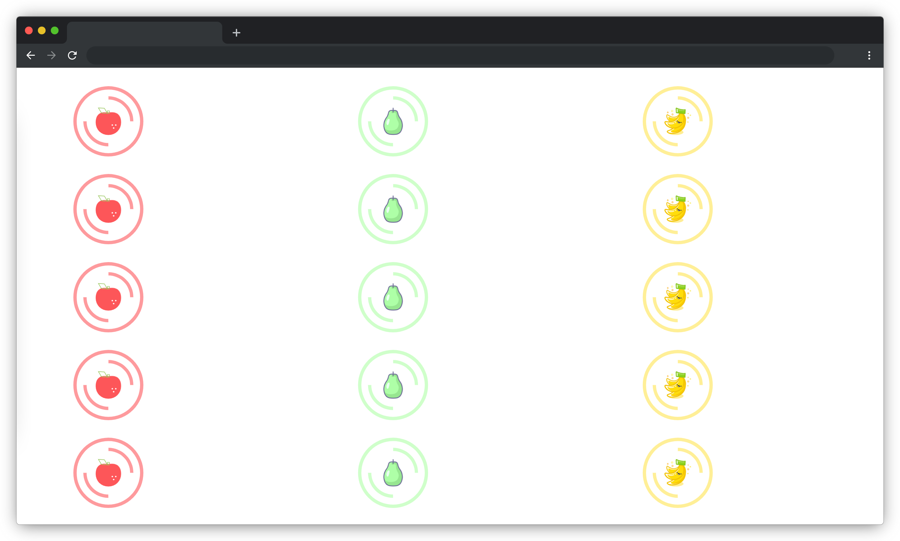

# 水果拼盘

## 介绍

目前 CSS3 中新增的 Flex 弹性布局已经成为前端页面布局的首选方案，本题可以使用 Flex 属性快速完成布局。

## 准备

开始答题前，需要先打开本题的项目代码文件夹，目录结构如下：

```txt
├── css
│   └── style.css
├── images
│   ├── apple.svg
│   ├── banana.svg
│   ├── blueplate.svg
│   ├── redplate.svg
│   ├── yellowplate.svg
│   └── pear.svg
└── index.html
```

其中：

- `css/style.css` 是需要补充的样式文件。
- `index.html` 是主页面。
- `images` 是图片文件夹。

注意：打开环境后发现缺少项目代码，请手动键入下述命令进行下载：

```bash
cd /home/project
wget https://labfile.oss.aliyuncs.com/courses/9791/01.zip && unzip 01.zip && rm 01.zip
```

在浏览器中预览 `index.html` 页面效果如下：



## 目标

建议使用 `flex` 相关属性完成 `css/style.css` 中的 TODO 部分。

1. 禁止修改圆盘的位置和图片的大小。
2. 相同颜色的水果放在相同颜色的圆盘正中间（例如：苹果是红色的就放在红色的圆盘里）。

完成后，页面效果如下：


## 规定

- 禁止修改圆盘的位置和图片的大小。
- 请勿修改项目中的 DOM 结构。
- 请严格按照考试步骤操作，切勿修改考试默认提供项目中的文件名称、文件夹路径等。

## 判分标准

- 本题完全实现题目目标得满分，否则得 0 分。
