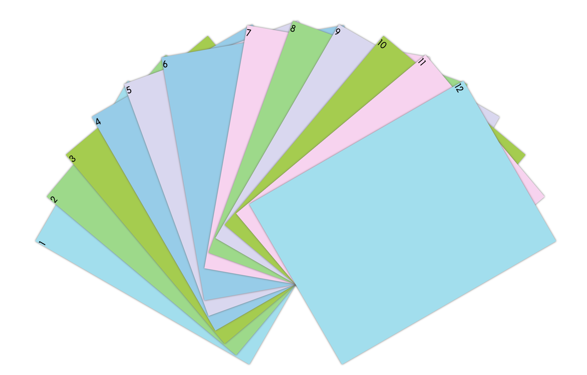

# 展开你的扇子

## 介绍

网站上为了让内容显示不臃肿，我们可以做一个折叠展开的效果。本题将使用 CSS3 实现元素呈扇形展开的效果。

## 准备

开始答题前，需要先打开本题的项目代码文件夹，目录结构如下：

```txt
├── css
│   └── style.css
├── effect.gif
└── index.html
```

其中：

- `css/style.css` 是样式文件。
- `effect.gif` 是最终实现的效果图。
- `index.html` 是主页面。

注意：打开环境后发现缺少项目代码，请手动键入下述命令进行下载：

```bash
cd /home/project
wget https://labfile.oss.aliyuncs.com/courses/9791/02.zip && unzip 02.zip && rm 02.zip
```

在浏览器中预览 `index.html` 页面，鼠标悬浮在元素上，元素不会展开，效果如下：



## 目标

请完善 `css/style.css` 文件（**请勿修改文件夹中已给出的代码，以免造成判题无法通过**）。

当鼠标**悬浮**在元素上，元素呈扇形展开，页面效果如下所示：


完成后的效果见文件夹下面的 gif 图，图片名称为 `effect.gif`（提示：可以通过 VS Code 或者浏览器预览 gif 图片）。

具体说明如下：

- 页面上有 12 个相同大小的 `div` 元素。
- 这 12 个 `div` 元素具有不同的背景颜色。
- 前 6 个 `div` 元素（`id="item1"~id="item6"`）均为**逆时针**转动，其**最小**转动的角度为 `10 deg`，相邻元素间的角度差为 `10 deg`。
- 后 6 个 `div` 元素（`id="item7"~id="item12"`）均为**顺时针**转动，其**最小**转动的角度为 `10 deg`，相邻元素间的角度差为 `10 deg`。
- 注意，元素 6（`id="item6"`）和元素 7（`id="item7"`），各自反方向转动 `10 deg`，所以它们之间的角度差为 `20 deg`。

## 规定

- 请勿修改 `index.html` 文件中的任何内容。
- 请勿修改 `css/style.css` 文件中已给出的代码。
- 请严格按照考试步骤操作，切勿修改考试默认提供项目中的文件名称、文件夹路径等，以免造成无法判题通过。

## 判分标准

- 本题完全实现题目目标得满分，否则得 0 分。
