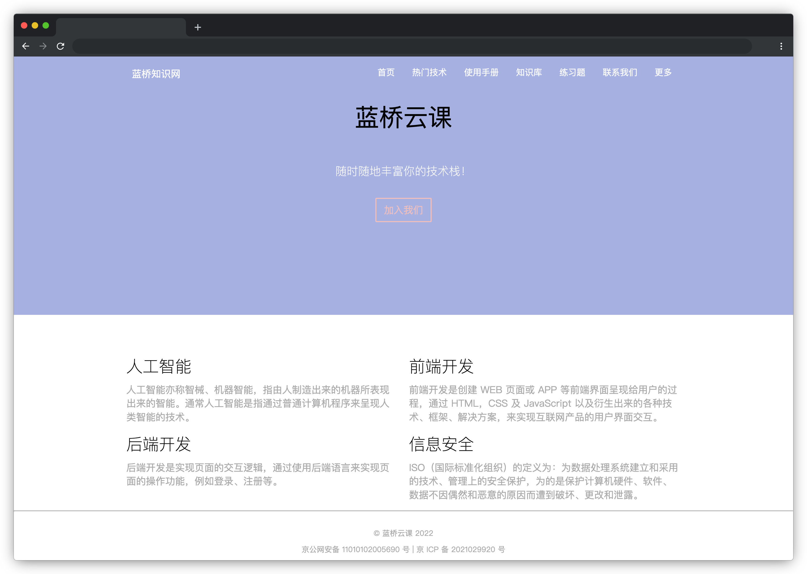

# 蓝桥知识网

## 介绍

蓝桥为了帮助大家学习，开发了一个知识汇总网站，现在想设计一个简单美观的首页。本题请根据要求来完成一个首页布局。

## 准备

开始答题前，需要先打开本题的项目代码文件夹，目录结构如下：

```txt
├── css
│   └── style.css
├── data.txt
├── index.html
└── mark.png
```

其中：

- `css/style.css` 是样式文件。
- `data.txt` 是页面数据文件。
- `index.html` 是主页面。
- `mark.png` 是页面参数标注图。

注意：打开环境后发现缺少项目代码，请手动键入下述命令进行下载：

```bash
cd /home/project
wget https://labfile.oss.aliyuncs.com/courses/9791/06.zip && unzip 06.zip && rm 06.zip
```

## 目标

请根据 `mark.png` 图片上的参数标注，补充 `css/style.css` 和 `index.html` 文件中的代码。对于 mark.png 上未标注的参数，请结合效果图自行调整。

页面版心宽度为 `1024px`，请保证版心居中，让页面呈现如下图所示的效果：



页面数据在 `data.txt` 文件中，直接复制即可。

## 规定

- 请勿自定义页面数据，必须使用 `data.txt` 所提供的页面数据。
- 请严格按照考试步骤操作，切勿修改考试默认提供项目中的文件名称、文件夹路径等，以免造成无法判题通过。

## 判分标准

- 本题根据页面布局的相似度给分，低于 50% 得 0 分，高于 50% 则按比例给分。
