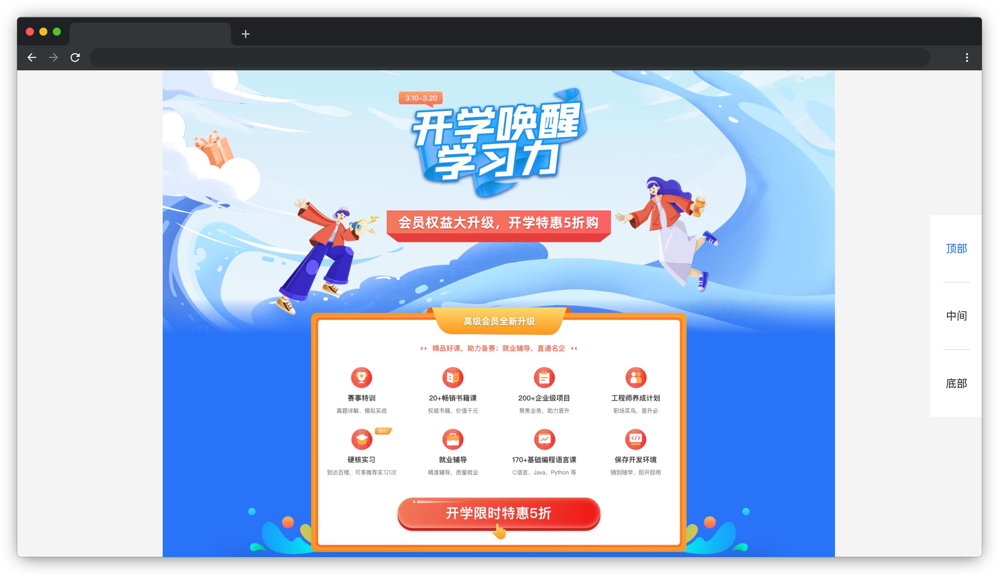

# 传送门

## 介绍

日常浏览网页的时候，我们会发现一个问题，当页面太长、内容太多的时候我们很难快速浏览到心仪的内容。为了解决这个烦恼，优秀的产品研发团队发明了一种类似传送门的功能，以便用户能通过它快速定位到感兴趣的内容。这个功能也被通俗地比喻为“电梯”。

本题需要在已提供的基础项目中使用 JS/jQuery 等知识完善代码，最终实现该功能。

## 准备

开始答题前，需要先打开本题的项目文件夹，目录结构如下：

```txt
├── effect.gif
├── index.html
├── css
├── images
└── js
    ├── index.js
    └── jquery-3.6.0.min.js
```

其中：

- `effect.gif` 是最终实现的效果图。
- `index.html` 是主页面。
- `css` 是样式文件夹。
- `images` 是素材图片文件夹。
- `js/index.js` 是需要补充代码的 js 文件。
- `js/jquery-3.6.0.min.js` 是 jQuery 文件。

注意：打开环境后发现缺少项目代码，请手动键入下述命令进行下载：

```bash
cd /home/project
wget https://labfile.oss.aliyuncs.com/courses/9790/01.zip && unzip 01.zip && rm 01.zip
```

在浏览器中预览 `index.html` 页面，显示如下所示：



## 目标

请在 `js/index.js` 文件中补全代码，最终实现**传送门**的功能。

具体需求如下：

1. 点击页面侧边的**顶部、中间或底部**按钮，页面滚动到**顶部、中间或底部**对应的范围内。这三个范围的设定如下：

- 顶部：滚动条距离页面顶部 0 ～ 960px（不包含 960）的范围。
- 中间：滚动条距离页面顶部 960 ～ 1920px（包含 960，不包含 1920）的范围。
- 底部：滚动条距离页面顶部大于等于 1920px 的范围。

2. 当页面滚动到**顶部、中间或底部**位置时，对应的侧边按钮（即，**顶部、中间或底部**按钮）添加激活样式（即 **`.active-color`**），其余按钮样式变为默认（即 **`.default-color`**）。

完成后的效果见文件夹下面的 gif 图，图片名称为 `effect.gif`（提示：可以通过 VS Code 或者浏览器预览 gif 图片）。

## 规定

- 请勿修改 `js/index.js` 文件外的任何内容。
- 请严格按照考试步骤操作，切勿修改考试默认提供项目中的文件名称、文件夹路径、class 名、id 名、图片名等，以免造成无法判题通过。

## 判分标准

- 实现点击侧边按钮快速定位内容功能，得 2 分。
- 实现侧边按钮文字颜色随页面内容滚动而变化功能，得 3 分。
