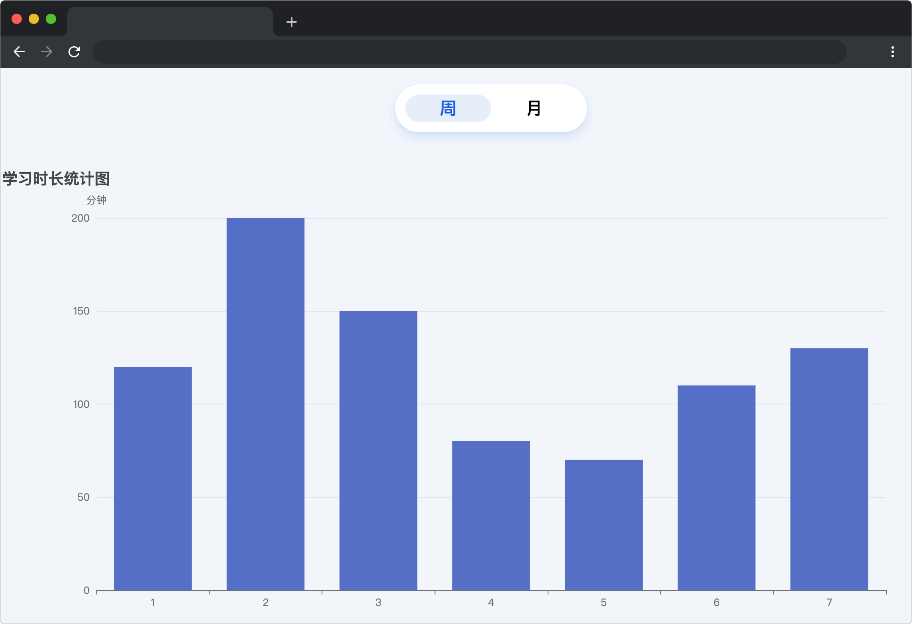
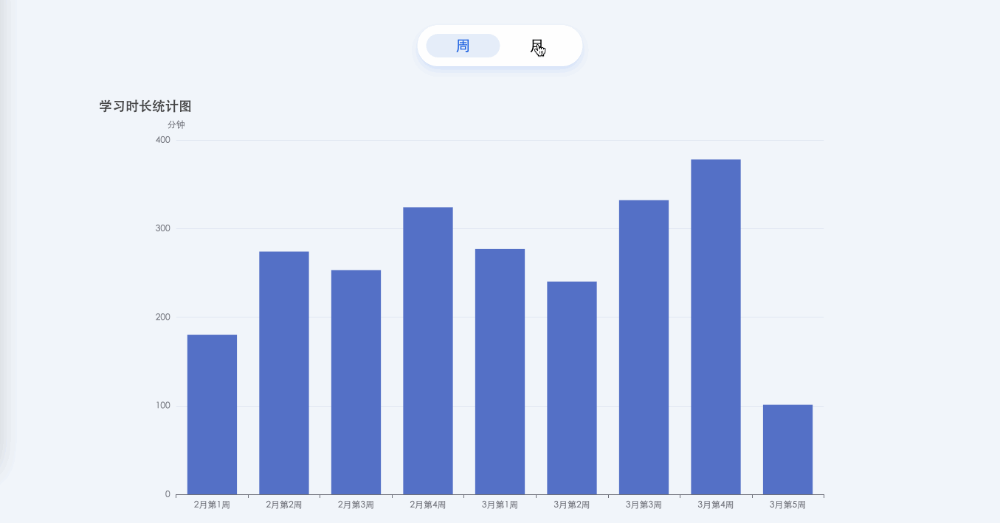

# 学海无涯

## 介绍

小蓝最近一直在云课平台学习，为了更好的督促自己，于是将每天的学习时间都记录了下来，但是如何更加直观的显示学习时间让小蓝很是苦恼。本题需要你使用 ECharts 帮助小蓝实现统计学习时间图表。

## 准备

本题已经内置了初始代码，打开实验环境，目录结构如下：

```txt
├── css
│   └── style.css
├── data.json
├── index.html
└── js
    ├── axios.min.js
    └── echarts.min.js
```

其中：

- `index.html` 是主页面。
- `js/echarts.min.js` 是 ECharts 文件。
- `js/axios.min.js` 是 axios 文件。
- `css/style.css` 是样式文件。
- `data.json` 是学习时长数据。

选中 `index.html` 右键启动 Web Server 服务（Open with Live Server），让项目运行起来。

接着，打开环境右侧的【Web 服务】，就可以在浏览器中看到如下效果：



## 目标

请完成 `index.html` 文件中的 TODO 部分。

1. 完成数据请求（数据来源 `./data.json`），`data.json` 中存放的数据为对应月份中小蓝每天的学习时长，单位为分钟（在项目目录下已经提供了 `axios`，考生可自行选择是否使用）。
2. 页面加载完成后，**默认显示**周统计数据。点击周和月，x 轴对应显示正确的周数(格式为:"x 月 x 周")和月份，Y 轴显示小蓝对应周和对应月学习的**总时长**。

完成后，最终页面效果如下：



## 规定

- 请勿修改 `js/echarts.min.js` 文件中的任何内容。
- 请严格按照考试步骤操作，切勿修改考试默认提供项目中的文件名称、文件夹路径等，以免造成无法判题通过。

## 判分标准

- 完成数据请求，得 5 分。
- 初始化数据显示正确，得 5 分。
- 点击周和月切换后，数据显示正确，得 5 分。
