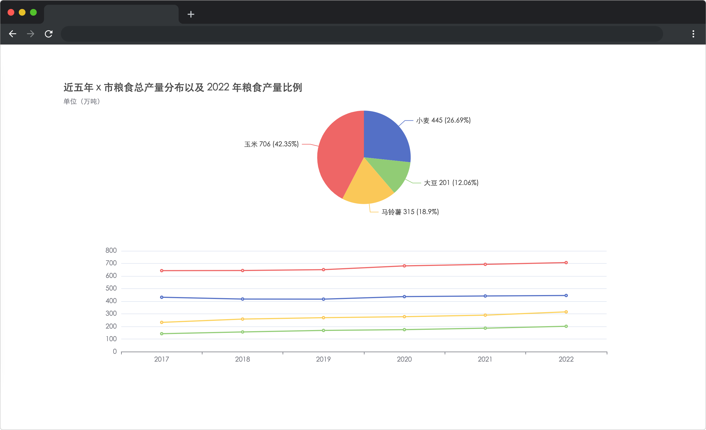

# 粒粒皆辛苦

## 介绍

俗话说“民以食为天”，粮食的收成直接影响着民生问题，通过对农作物产量的统计数据也能分析出诸多实际问题。

接下来就让我们使用 ECharts 图表，完成 X 市近五年来的农作物产量的统计图吧～

## 准备

本题已经内置了初始代码，打开实验环境，目录结构如下：

```txt
├── data.json
├── index.html
└── js
    ├── axios.min.js
    └── echarts.min.js
```

其中：

- `index.html` 是主页面。
- `js/echarts.min.js` 是 ECharts 文件。
- `js/axios.min.js` 是 axios 文件。
- `data.json` 是对应年份的粮食产量数据，单位为万吨。

选中 `index.html` 右键启动 Web Server 服务（Open with Live Server），让项目运行起来。

接着，打开环境右侧的【Web 服务】，就可以在浏览器中看到如下效果：



## 目标

请完成 `index.html` 文件中的 TODO 部分。

1. 完成数据请求（数据来源 `./data.json`）。
2. `data.json` 中的数据中英文对照如下：

| 英文名称 | 中文名称 |
| :------: | :------: |
|  wheat   |   小麦   |
| soybean  |   大豆   |
|  potato  |  马铃薯  |
|   corn   |   玉米   |

3. 在页面的折线图和饼形图中正确显示粮食产量数据。其中折线图为五年数据，饼图只显示 2022 年数据。

完成后，最终页面效果如下：


## 规定

- 请勿修改已经提供的代码，以免造成判题无法通过。
- 请严格按照考试步骤操作，切勿修改考试默认提供项目中的文件名称、文件夹路径等。
- 满足题目需求后，保持 Web 服务处于可以正常访问状态，点击「提交检测」系统会自动判分

## 判分标准

- 本题完全实现题目目标得满分，否则得 0 分。
