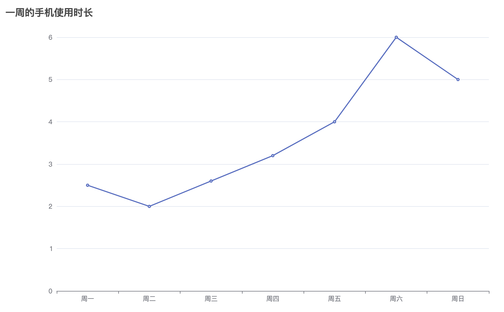

# 和手机相处的时光

## 介绍

现在都提倡健康使用手机，那么统计一下在一周中每天使用手机的情况吧！本题使用 ECharts 实现统计手机使用时长的折线图，但是代码中存在 Bug 需要你去修复。

## 准备

开始答题前，需要先打开本题的项目代码文件夹，目录结构如下：

```txt
├── js
│   └── echarts.js
└── index.html
```

其中：

- `js/echarts.js` 是 ECharts 文件。
- `index.html` 是主页面。

注意：打开环境后发现缺少项目代码，请手动键入下述命令进行下载：

```bash
cd /home/project
wget https://labfile.oss.aliyuncs.com/courses/9791/03.zip && unzip 03.zip && rm 03.zip
```

在浏览器中预览 `index.html` 页面效果显示如下所示：



## 目标

请修复 `index.html` 文件中的 Bug。

让页面呈现如下所示的效果：


具体说明如下：

- 用折线图显示了一周当中，每天使用手机的时长。
- `index.html` 文件里 `var option = {}` 中的内容是 ECharts 的配置项，该配置中存在 Bug，导致坐标轴显示不正确。
- 在配置项中，`title` 是用于设置折线图的标题。
- 在配置项中，`series` 是系列，其中的 `data` 是一周中每天使用手机的时间数据，`type` 是图表的类型为折线图。

## 规定

- 请勿修改 `js/echarts.js` 文件中的任何内容。
- 在 `index.html` 文件中，只能修改 ECharts 的配置项，配置项以外的代码不能修改。
- 请严格按照考试步骤操作，切勿修改考试默认提供项目中的文件名称、文件夹路径等，以免造成无法判题通过。

## 判分标准

- 本题完全实现题目目标得满分，否则得 0 分。
