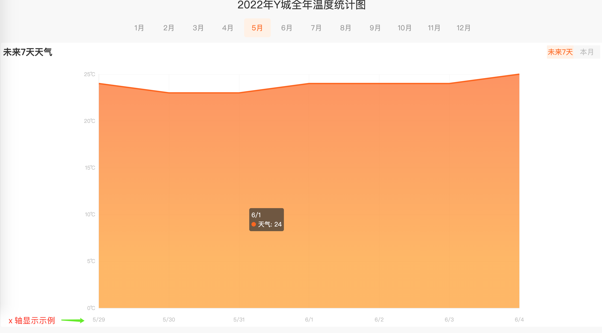

# 天气趋势 B

## 介绍

日常生活中，气象数据对于人们的生活具有非常重要的意义，数据的表现形式多种多样，使用图表进行展示使数据在呈现上更加直观。

本题请实现一个 Y 城 2022 年的天气趋势图。

## 准备

开始答题前，需要先打开本题的项目代码文件夹，目录结构如下：

```txt
├── css
│   └── style.css
├── effect-1.gif
├── effect-2.gif
├── index.html
└── js
    ├── axios.js
    ├── echarts.min.js
    ├── vue.min.js
    └── weather.json
```

其中：

- `css/style.css` 是样式文件。
- `index.html` 是主页面。
- `js/axios.js` 是 axios 文件。
- `js/vue.min.js` 是 vue2.x 文件。
- `js/echarts.min.js` 是 echarts 文件。
- `js/weather.json` 是请求需要用到的天气数据。
- `effect-1.gif` 是当月和未来七天切换的效果图。
- `effect-2.gif` 是最终完成的效果图。

注意：打开环境后发现缺少项目代码，请手动键入下述命令进行下载：

```bash
cd /home/project
wget https://labfile.oss.aliyuncs.com/courses/9790/09.zip && unzip 09.zip && rm 09.zip
```

在浏览器中预览 `index.html` 页面效果如下：



## 目标

请在 `index.html` 文件中补全代码，具体需求如下：

1. 完成数据请求（数据来源 `./js/weather.json`），`weather.json` 中存放的数据为 `12` 个月对应的温度数据。在项目目录下已经提供了 `axios`，考生可自行选择是否使用。注意：调试完成后请将请求地址写死为 `./js/weather.json`。
2. 把 `data` 中的月份数据 `monthList`， 在 `class=month` 标签下面的 `li` 上完成渲染，点击月份则切换对应月份的温度数据同时被点击的月份会变成激活状态(` .active 类`)，x 轴为日期，y 轴为温度，默认显示 `1` 月份数据。


3. 如果点击的月份是当天（通过时间函数动态获取的时间）所在月份，本月和未来七天切换的 `tab` （即 `id=currentMonth` 元素）显示，其他月份 `currentMonth` 元素不显示。

- 默认显示本月数据。
- 点击**本月**显示当月数据，点击**未来七天**显示从当天(包含当天)开始未来七天的数据，当显示未来七天数据时 x 轴需要显示为月/日格式。
- 点击 `tab` 上**本月**和**未来七天**会切换激活状态（`.active`）。

以当天为 5 月 29 号为例，未来七天 `x` 轴显示示例（即 x 轴显示成：5/29，5/30，5/31，6/1，6/2，6/3，6/4）：


**本月**和**未来七天** 切换效果见文件夹下 `effect-1.gif`。

最终效果见文件夹下面的 gif 图，图片名称为 `effect-2.gif`（提示：可以通过 VS Code 或者浏览器预览 gif 图片）

## 规定

- 请求地址为`./js/weather.json`，切勿写成其他地址格式，以免造成无法判题通过。
- 请严格按照考试步骤操作，切勿修改考试默认提供项目中的文件名称、文件夹路径、class 名、id 名、图片名等，以免造成无法判题通过。

## 判分标准

- 完成目标 1，得 5 分。
- 完成目标 2，得 10 分。
- 完成目标 3，得 10 分。
