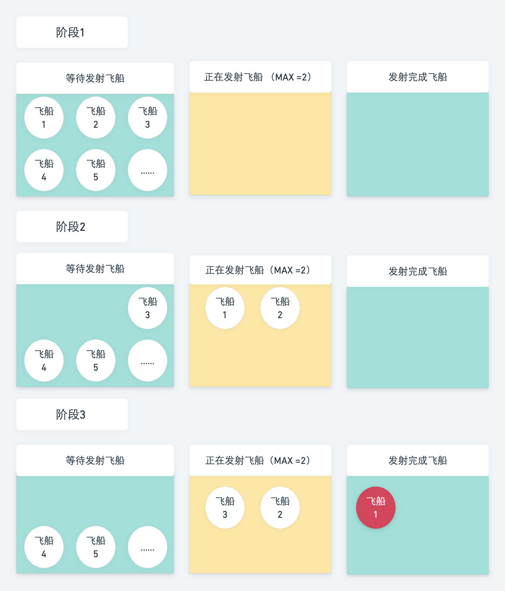

# 逃离二向箔

## 介绍

歌者文明的二向箔目前已经到达太阳系，二向箔的封装力场已经消失，接触到太阳系的三维空间后，导致三维立体空间塌陷，变成二维平面空间并不断扩展。倘若能借助曲率引擎等手段以光速先行逃离，那么摆脱二维化的命运依然是可能的。

目前人类已经开发出曲率飞船，停放飞船的港口一次性只能发送 10 辆飞船，并且飞船的启动时间为 3000ms 。下面由你来开发一个 `RequestControl` 类收集飞船的发射请求，依据飞船的结果自动安排下一批次的飞船发射，帮助人类逃离二向箔的打击。但是由于发射飞船的装置限制，一次最多发送的飞船有数量限制。

## 准备

本题已经内置了初始代码，打开实验环境，目录结构如下：

```txt
├── index.html
└── main.js
```

其中：

- `index.html` 是主页面。
- `main.js` 是待补充代码的 js 文件。

在 `main.js` 文件中：

- `createRequest` 方法为发射飞船请求的 `promise`。
- `RequestControl` 类的 `addRequest` 方法收集飞船发射请求。并将飞船发射请求放入 `this.requestQueue` 发射队列中。
- `run` 方法实现依据发射结果自动排配下一批次的飞船发射。
- `render` 用来在页面渲染每次飞船发射结果。

选中 `index.html` 右键启动 Web Server 服务（Open with Live Server），让项目运行起来。初始化无任何效果。

## 目标

找到 `main.js` 文件中的 `run` 函数，完成函数中的 TODO 部分。

1. 传递给 `RequestControl` 的 `max` 参数是当前时刻的飞船最大发射数量。
2. 飞船为逐个发射，发射后返回 `promise` 结果。每个飞船发射后会空出一个发射位置，下一个飞船就在这个发射位置发射。
3. 通过 `render` 函数将发射的结果渲染到页面，`render` 函数的参数为飞船发射 `promise` 返回的结果。

以 `max =2` 为例，飞船发射流程如下图：



完成后，最终页面效果如下：


## 规定

- 请勿修改已经提供的代码，以免造成判题无法通过。
- 请严格按照考试步骤操作，切勿修改考试默认提供项目中的文件名称、文件夹路径等。

## 判分标准

- 本题完全实现题目目标得满分，否则得 0 分。
