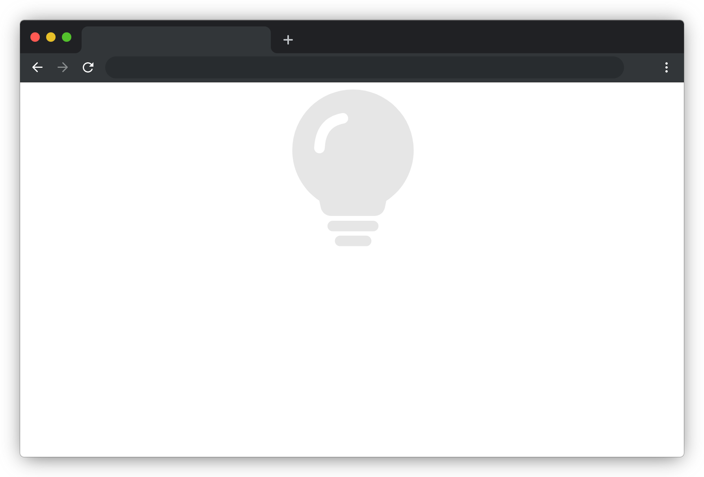

# 灯的颜色变化

## 介绍

我们经常会看到各种颜色的灯光，本题我们将实现一个颜色会变化的灯的效果。

## 准备

开始答题前，需要先打开本题的项目代码文件夹，目录结构如下：

```txt
├── effect.gif
├── images
│   ├── greenlight.svg
│   ├── light.svg
│   └── redlight.svg
├── index.html
└── js
    └── trafficlights.js
```

其中：

- `index.html` 是主页面。
- `images` 是图片文件夹。
- `js/trafficlights.js` 是需要补充的 js 文件。
- `effect.gif ` 是最终实现的效果图。

注意：打开环境后发现缺少项目代码，请手动键入下述命令进行下载：

```bash
cd /home/project
wget https://labfile.oss.aliyuncs.com/courses/9791/04.zip && unzip 04.zip && rm 04.zip
```

在浏览器中预览 `index.html` 页面效果如下：



## 目标

完成 `js/trafficlights.js` 文件中的 `red`、`green` 和 `trafficlights` 函数，达到以下效果：

1. 页面加载完成 3 秒后灯的颜色变成红色。
2. 在灯的颜色变成红色的 3 秒后，灯的颜色变成绿色（即 6 秒后灯光变成绿色）。
3. 随后颜色不再变化。
4. 请通过修改 `display` 属性来显示不同颜色的灯的图片。

完成后的效果见文件夹下面的 gif 图，图片名称为 `effect.gif`（提示：可以通过 VS Code 或者浏览器预览 gif 图片）。

## 规定

- 请通过修改 `display` 属性来显示不同颜色的灯的图片，以免造成无法判题通过。
- 请勿修改项目中提供的 `id`、`class`、函数名称、已有样式，以免造成无法判题通过。
- 请严格按照考试步骤操作，切勿修改考试默认提供项目中的文件名称、文件夹路径等。

## 判分标准

- 本题完全实现题目目标得满分，否则得 0 分。
