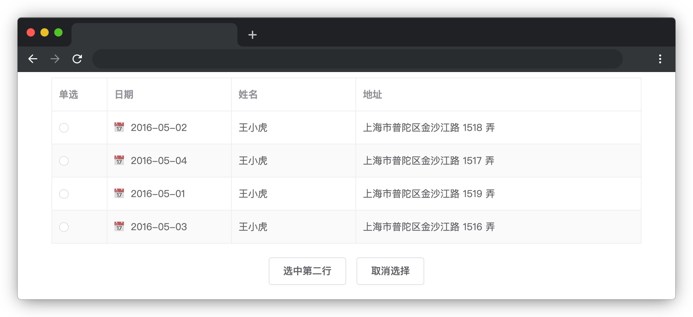
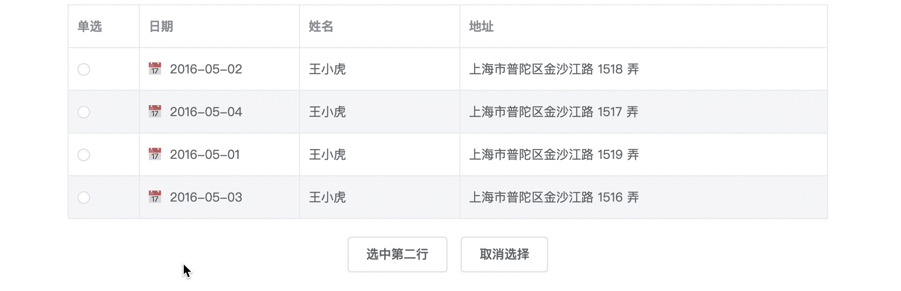

# element-ui 组件二次封装

## 介绍

在使用 element-ui 开发的过程中，对表格的使用比较多，且在同一个系统中表格的样式基本上是固定的，功能也基本一样。若每写一个页面都要去复制一份表格的代码，就会产生大量重复的代码，既不利于后期的维护，代码也不够简洁。为此需要前端工程师对 element-ui 的原组件进行二次封装。

## 准备

本题已经内置了初始代码，打开实验环境，目录结构如下：

```txt
├── element-ui-2.15.10
│   ├── index.css
│   └── index.js
├── index.html
├── js
│   ├── http-vue-loader.js
│   └── vue.min.js
└── mytable.vue
```

其中：

- `index.html` 是主页面。
- `mytable.vue` 是待封装的表格组件文件。
- `js` 是用于存放 Vue.js 相关文件的文件夹。
- `element-ui-2.15.10` 是存放 element-ui 的文件夹。

在浏览器中预览 `index.html` 页面效果显示如下所示：



## 目标

element-ui 官网上具有单选功能的表格 demo 为：点击表格下方的按钮可以选中指定的某行数据。效果如下：



从上图可以看到表格的左边有一列单选组件，但是并未实现单选功能。


现在需要我们完善 `mytable.vue` 文件中的 TODO 部分，实现点击某个单选组件选中该行数据的效果。效果如下：


实现该功能所需的 api 如下：

#### table 参数说明

属性参数：

| 参数                    | 说明               | 类型    |
| ----------------------- | ------------------ | ------- |
| `data`                  | 显示的数据         | array   |
| `stripe`                | 是否为斑马纹 table | boolean |
| `highlight-current-row` | 是否要高亮当前行   | boolean |

其中如果对表格中某个字段数据呈现个性化显示效果，则可以利用 `Scoped slot` 获取到 `row`，`column`，`$index` 和 `store`（table 内部的状态管理）的数据。用法参考下面示例：

```html
<el-table-column label="日期" width="180">
  <template slot-scope="scope">
    📅<span style="margin-left: 10px">{{ scope.row.date }}</span>
  </template>
</el-table-column>
```

#### radio 参数说明

属性参数：

| 参数                | 说明             | 类型                      |
| ------------------- | ---------------- | ------------------------- |
| `value` / `v-model` | 绑定值           | string / number / boolean |
| `label`             | Radio 的 `value` | string / number / boolean |

事件参数：

| 事件名称 | 说明                   | 回调参数                |
| -------- | ---------------------- | ----------------------- |
| `change` | 绑定值变化时触发的事件 | 选中的 Radio `label` 值 |

## 规定

- 请严格按照考试步骤操作，切勿修改考试默认提供项目中的文件名称、文件夹路径、`id`、`class`、DOM 结构、以及函数名等，以免造成无法判题通过。

## 判分标准

- 本题完全实现题目目标得满分，否则得 0 分。
