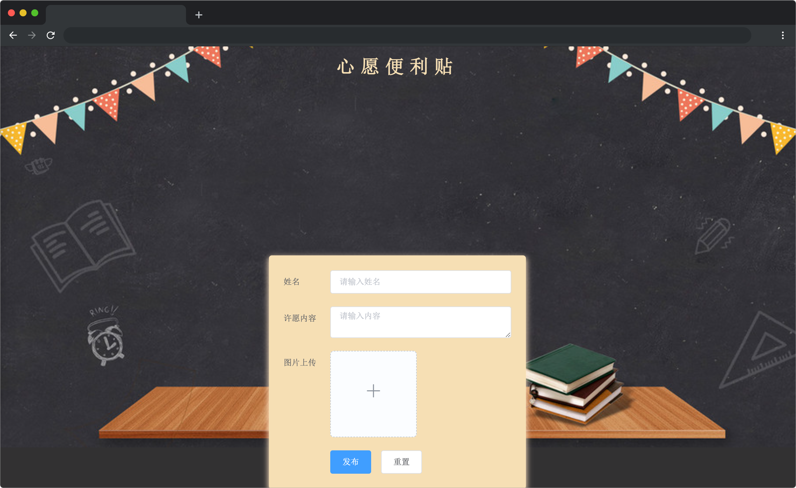
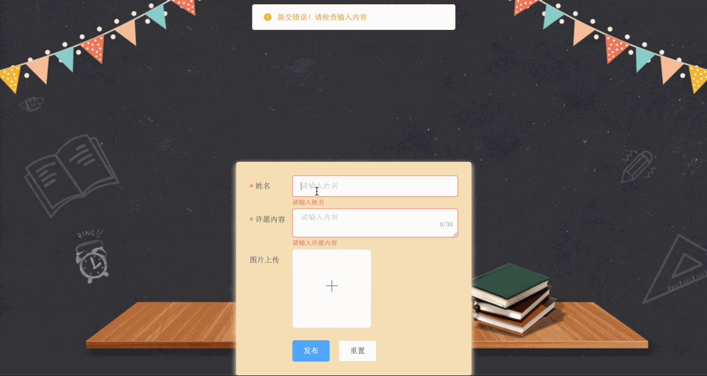

# 心愿便利贴 

## 介绍

小蓝发现人之间面对面交流逐渐减少，倾诉的机会变少了，有些人比较腼腆保守，不敢大声说出自己的心里话，期盼之类的，容易造成压力过大，心愿便利贴可以匿名，提供大家安全隐秘方便的倾诉平台。

小蓝希望大家写下自己的目标、理想、愿望等，激励自己奋斗，积极向上......写出来做一个精神寄托。 

可是，小蓝对 Vue 语法不熟，便利贴没能完成，快来帮助小蓝完成吧！

## 准备

本题已经内置了初始代码，打开实验环境，目录结构如下：

```txt
├── css
│   ├── fonts
│   │   ├── element-icons.ttf
│   │   └── element-icons.woff
│   ├── index.css
│   └── wish.css
├── images
│   ├── bg.jfif
│   └── ding.png
├── index.html
└── js
    ├── index.js
    └── vue.min.js
```

其中：

- `index.html` 是主页面。
- `css` 是 `element-ui` 存放项目样式的文件夹。
- `images` 是图片文件夹。
- `js` 是项目所依赖的 js 库的文件夹。

注意：打开环境后发现缺少项目代码，请复制下述命令至命令行进行下载。

```bash
wget https://labfile.oss.aliyuncs.com/courses/18164/wish.zip && unzip wish.zip && rm wish.zip
```


在浏览器中预览 `index.html` 页面效果如下：



在初始化的时候输入框并没有做验证，输入内容发布后，许愿贴并不能出现。


## 目标

请在 `index.html` 文件中补全代码，具体需求如下：

  1. 将填写完的表单正确渲染到许愿墙上。
  2. 完成表单验证，姓名（必填项） 2-4 个字符，许愿内容（必填项）长度在 1 到 30 个字符。

本项目使用到的 `element-ui` 表单验证 API 如下：

表单属性

| 参数 |说明| 类型  | 
|--|--|--|
| rules|	表单验证规则|	object|

表单项属性

|参数	|说明	|类型	|可选值	|默认值|
|--|--|--|--|--|
|prop	|表单域 model 字段，在使用 validate、resetFields 方法的情况下，该属性是必填的	|string	|传入 Form 组件的 model 中的字段|	-|
|required|	是否必填|	boolean|-|	false|
|trigger|验证时触发的事件|string|click/focus/change/blur/input|-|
|min|最小长度|number|-|-|
|max|最大长度|number|-|-|
|message|验证不通过时的错误信息|string|-|-|

使用示例

```html

   <el-form-item label="姓名" prop="activeName">
      <el-input v-model="form.activeName" placeholder="请输入姓名"></el-input>
    </el-form-item>
// ....
 rules: {
          activeName: [
            { required: true, message: '请输入活动名称', trigger: 'blur' },
            { min: 3, max: 5, message: '长度在 3 到 5 个字符', trigger: 'blur' }
          ],
    }
```

完成后效果如下：



## 规定

- 请按照给出的步骤操作，切勿修改默认提供的文件名称、文件夹路径等。
- 满足需求后，保持 Web 服务处于可以正常访问状态，点击「提交检测」系统会自动检测。

## 判分标准

- 本题完全实现题目目标得满分，否则得 0 分。
