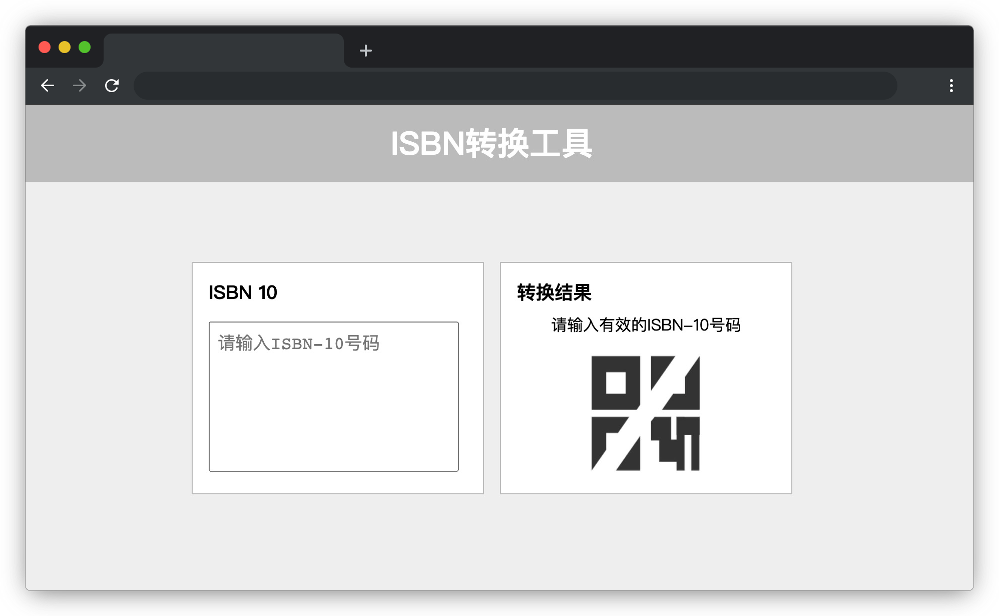
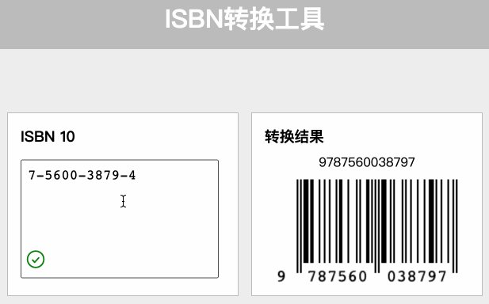

# ISBN 转换与生成

## 介绍

国际标准书号（International Standard Book Number），简称 ISBN ，是专门为识别图书等文献而设计的国际编号。2007 年 1 月 1 日之前，ISBN 由 10 位数字组成，包括四个部分：组号（国家、地区、语言的代号），出版者号，书序号和检验码。2007 年 1 月 1 日起，实行新版 ISBN，新版 ISBN 由 13 位数字组成。新版 ISBN 编码增加了 EAN·UCC 前缀，这是为了与国际条形码编码 EAN·UCC 系统接轨。

本题请实现一个 `ISBN-10`（旧版 10 位 ISBN ）到 `ISBN-13`（新版 13 位 ISBN ）码的转换工具。

## 准备

开始答题前，需要先打开本题的项目代码文件夹，目录结构如下：

```txt
├── css
│   └── style.css
├── effect.gif
├── images
│   ├── check-one.png
│   ├── close-one.png
│   └── fail-picture.png
├── index.html
└── js
    ├── JsBarcode.ean-upc.min.js
    ├── index.js
    └── vue.min.js
```

其中：

- `css/style.css` 是样式文件。
- `index.html` 是主页面。
- `images` 文件夹内包含了页面使用的 icon。
- `js/JsBarcode.ean-upc.min.js` 是项目使用的条形码生成库。
- `js/index.js` 是页面 `js` 文件。
- `js/vue.min.js` 是 `vue` 文件。
- `effect.gif` 是页面最终的效果图。

注意：打开环境后发现缺少项目代码，请复制下述命令至命令行进行下载：

```bash
cd /home/project
wget https://labfile.oss.aliyuncs.com/courses/18213/ISBN.zip
unzip ISBN.zip && rm ISBN.zip
```

在浏览器中预览 `index.html` 页面效果如下：



## 目标

请在 `js/index.js` 文件中补全代码，具体需求如下：

1. 补充 `getNumbers` 函数，剔除输入参数 `str` 中除了数字和大写 `X` 之外的其他字符，将其转换为只有纯数字和大写 `X` 字母的字符串。

2. 补充 `validISBN10` 函数，判断输入参数 `isbn` 是否是一个有效的 `ISBN-10` 字符串，并将判断结果（`true` 或 `false`）返回。有效的 `ISBN-10` 判断方法如下：

   - 有效的 `ISBN-10` 字符串是只有纯数字和大写 `X` 字母的字符串，其前九位是 0-9 之间的任意数字，最后一位校验位的值取决于前九位数字。

   - 校验位计算方法：用 1-9 这 9 个数依次乘以前面的 9 位数，然后求它们的和除以 11 的余数。如果余数为 10，则校验码用 `X` 表示，否则，校验码用该余数表示。
   - 以 `7-5600-3879-4` 为例，它的前 9 位数是 7、5、6、0、0、3、8、7、9，则其校验码的计算过程如下：

     ```txt
     1x7+2x5+3x6+4x0+5x0+6x3+7x8+8x7+9x9

     = 7+10+18+0+0+18+56+56+81

     = 246

     246 % 11 = 4

     因此，这个 ISBN-10 字符串的校验码就是4。
     ```

   - 以 `2-5600-3879-X` 为例，它的前 9 位数是 2、5、6、0、0、3、8、7、9，则其校验码的计算过程如下：

     ```txt
     1x2+2x5+3x6+4x0+5x0+6x3+7x8+8x7+9x9

     = 2+10+18+0+0+18+56+56+81

     = 241

     241 % 11 = 10

     因此，这个 ISBN-10 字符串的校验码就是X。
     ```

3. 补充 `ISBN10To13` 函数，将输入参数 `isbn` (一个有效的 `ISBN-10` 字符串) 转化为对应的 `ISBN-13` 字符串，并将转化后的字符串返回。转化步骤如下：

   - 将 `ISBN-10` 字符串的最后一位校验位去掉，剩下前九个数字。
   - 在字符串开头增加 978 三个数字，获得长度为 12 的数字字符串。
   - 计算最后一位校验位。`ISBN-13` 的校验码计算规则如下：用1分别乘书号的前12位中的奇数位, 用3乘以偶数位，然后求它们的和除以10的余数，最后用10减去这个余数，就得到了校验码。如果余数为0，则校验码为0。
   - 比如，7-5600-3879-4 在 ISBN-13 中，就是 978-7-5600-3879-7。它的校验码计算方法如下：
      ```txt
      9x1+7x3+8x1+7x3+5x1+6x3+0x1+0x3+3x1+8x3+7x1+9x3

      = 9+21+8+21+5+18+0+0+3+24+7+27

      = 143

      143 % 10 = 3

      10 - 3 = 7

      因此，这个 ISBN-13 字符串的校验码就是7。
      ```

下面是几个有效的 `ISBN-10` 号码，可供测试页面使用：

- 7-5600-3879-4
- 0198534531
- 3 5982 1508 8

上述 3 个需求正确实现后页面的最终效果见文件夹下面的 gif 图，图片名称为 `effect.gif`（提示：可以通过 VS Code 或者浏览器预览 gif 图片）。




## 规定

- 请严格按照考试步骤操作，切勿修改考试默认提供项目中的文件名称、文件夹路径、class 名、id 名、图片名等，以免造成无法判题通过。

## 判分标准

- 完成目标 1，得 5 分。
- 完成目标 2，得 10 分。
- 完成目标 3，得 5 分。