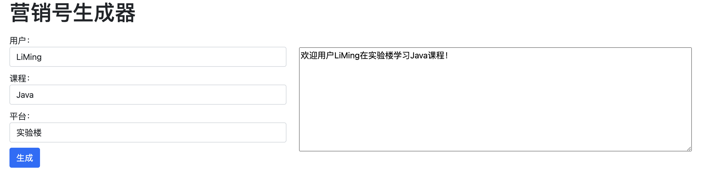

# 关于你的欢迎语

## 背景介绍

营销号，有时候需要一些特定的欢迎语，但针对特定的用户，我们希望可以个性化一点。本题需要在项目文件中修改代码存在的问题，实现根据模版生成特定用户的欢迎语。

## 步骤准备

在开始答题前，你需要在线上环境终端中键入以下命令，下载并解压所提供的文件。

```bash
wget https://labfile.oss.aliyuncs.com/courses/7835/exam04-imi.zip && unzip exam04-imi.zip && mv exam04-imi/* ./ && rm -rf exam04-imi*
```

下载完成之后的目录结构如下：

```txt
├── css
│   ├── bootstrap.min.css
│   └── style.css
├── js
│   ├── bootstrap.bundle.min.js
│   └── index.js
└── index.html
```

其中：

- `css/style.css` 是页面样式文件。
- `css/bootstrap.min.css` 和 `js/bootstrap.bundle.min.js` 是 Bootstrap 相关文件。
- `js/index.js` 是页面功能实现的逻辑代码。
- `index.html` 是页面布局。

1. 下载源码。
2. 选中 `index.html` 右键启动 Web Server 服务（Open with Live Server），让项目运行起来。
3. 打开环境右侧的【Web 服务】，就可以在浏览器中看到如下错误显示，当前显示没有正确获取到输入的用户、课程、平台的输入框内容。



## 考试要求

<div class="alert alert-success">

请修复 `index.js` 文件中存在的 bug，修复完成后，在表单的对应输入框中输入以下内容：


页面效果如下所示：


</div>

## 要求规定

- 请严格按照考试步骤操作，切勿修改考试默认提供项目中的文件名称、文件夹路径等。
- 满足题目需求后，保持 Web 服务处于可以正常访问状态，点击「提交检测」系统会自动判分。
