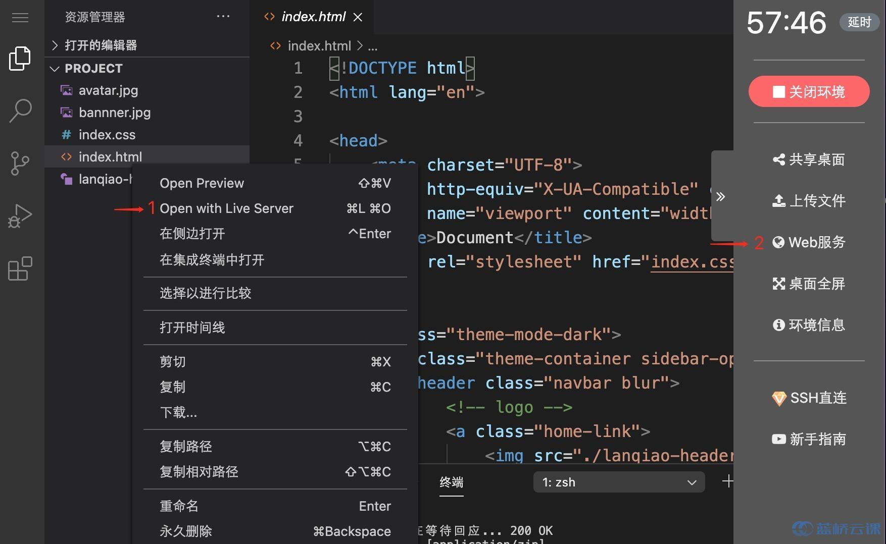
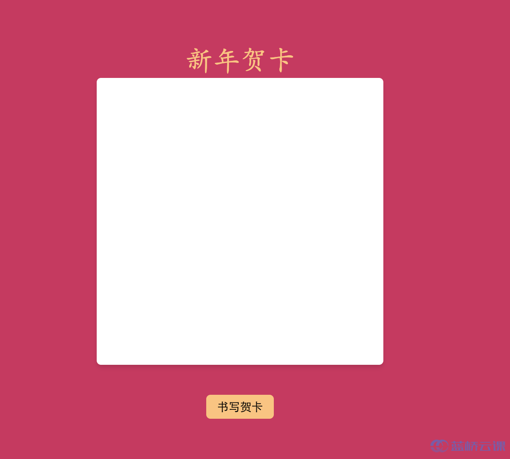
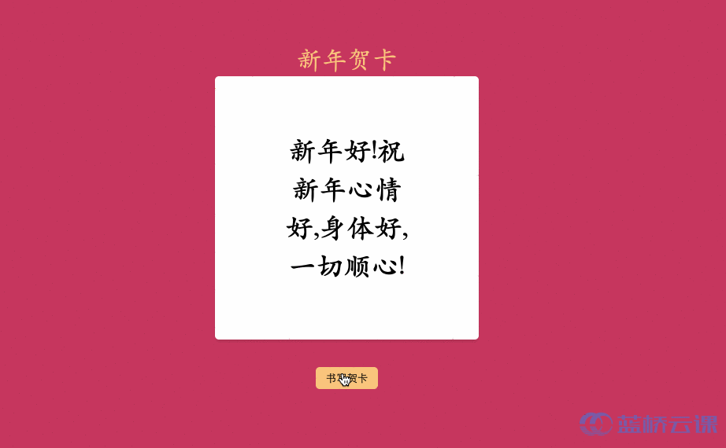

# 【功能实现】新年贺卡

## 背景介绍

新年马上到了，大家肯定有很多祝福的话语要对自己的亲人朋友说，下面我们一起来制作一张贺卡，让我们把想说的话都写在贺卡上。

## 准备步骤

在开始答题前，你需要在线上环境终端中键入以下命令，下载并解压所提供的文件。

```bash
wget https://labfile.oss.aliyuncs.com/courses/7835/ex01card.zip&& unzip ex01card.zip && rm ex01card.zip
```

下载完成之后的目录结构如下：

```txt
├── index.css
├── index.html
└── index.js
```

其中：

- `index.css` 是本次挑战的样式文件。
- `index.js` 是本次挑战需要补充的 js 文件。
- `index.html` 是贺卡页面。

1. 选中 index.html 右键启动 Web Server 服务（Open with Live Server），让项目运行起来。
2. 打开环境右侧的【Web 服务】。





## 考试要求

<div class="alert alert-success">

请仔细阅读需要完善代码部分的提示，之后完善 `index.js` 样式文件中的 TODO 部分，点击书写贺卡，卡片随机展示已经写好的祝福语：



</div>

## 要求规定

- 请严格按照考试步骤操作，切勿修改考试默认提供项目中的文件名称、文件夹路径等。
- 满足题目需求后，保持 Web 服务处于可以正常访问状态，点击「提交检测」系统会自动判分。
