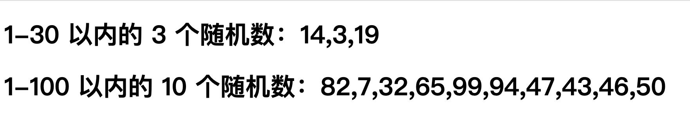

# 【算法实现】随机数生成器

## 背景介绍

实际工作中随机数的使用特别多，比如随机抽奖、随机翻牌。通过随机数还能实现很多有趣的效果，比如随机改变元素的位置或颜色。

本题需要在已提供的基础项目中使用 JS 知识封装一个函数，该函数可以根据需要，**生成指定范围和个数的不重复的随机数数组**。

## 步骤准备

在开始答题前，你需要在线上环境终端中键入以下命令，下载并解压所提供的文件。

```bash
wget https://labfile.oss.aliyuncs.com/courses/7835/exam12-imi.zip && unzip exam12-imi.zip && rm exam12-imi.zip
```

下载完成之后的目录结构如下：

```txt
├── index.html # 页面布局
└── js
    ├── index.js # 页面功能实现的逻辑代码
```

源码下载后，选中 `index.html` 右键启动 Web Server 服务（Open with Live Server），让项目运行起来。

接着，打开环境右侧的【Web 服务】，就可以在浏览器中看到如下效果：



当前并未生成并显示指定条件的随机数。

## 考试要求

<div class="alert alert-success">

请在 `index.js` 文件中补全函数 `getRandomNum` 中的代码，最终将根据指定条件生成的随机数显示在页面中。

具体需求如下：

1. 封装函数 `getRandomNum(min,max,countNum)`。
2. 生成 `min` ~ `max` 范围的 `countNum` 个不重复的随机数，最终这些随机数以一个数组的形式返回。

最终实现效果如下：


</div>

## 要求规定

- 请严格按照考试步骤操作，切勿修改考试默认提供项目中的文件名称、文件夹路径等。
- 满足题目需求后，保持 Web 服务处于可以正常访问状态，点击「提交检测」系统会自动判分。
