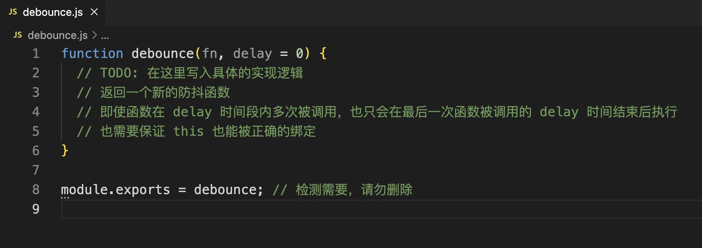
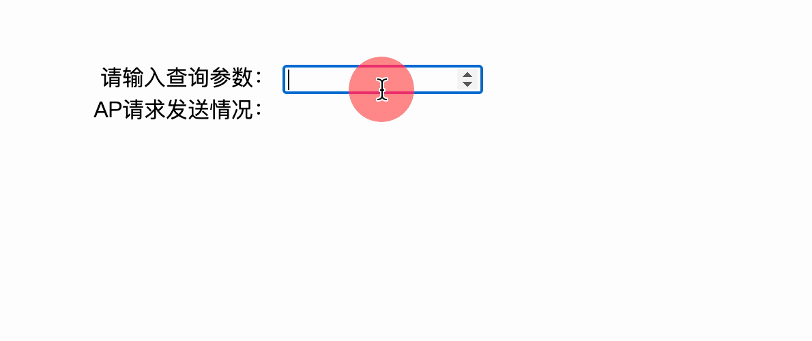

# 别抖了（防抖函数）

## 介绍

在平时的网页交互中，常常会有一些高频操作的场景，比如：

- 登录、发短信等按钮避免用户点击太快，以致于发送了多次请求。
- 调整浏览器窗口大小时，resize 次数过于频繁，造成计算过多。
- 文本编辑器实时保存。

上面这些场景在实际交互中会不断地调用绑定在事件（如：浏览器的 `resize`、`scroll`、`keypress`、`mousemove` 等）上的回调函数，极大地浪费资源，降低前端性能。为了优化体验，需要对这类事件进行调用次数的限制，对此我们就可以采用防抖（debounce）的方式来减少调用频率。

来看一下防抖的定义：n 秒后再执行某个函数，若该函数在 n 秒内被重复触发，则重新计时。

用一个比喻来说明就是：比如坐电梯，把电梯完成一次运送看作是一次函数的执行过程，那么电梯门关上的那一刻，则为开始执行函数的标志。假设电梯从检测到有人进入到关门之间的等待时间为 15 秒，不考虑容量限制，电梯第一个人进来后，等待 15 秒。如果过程中又有人进来，15 秒等待重新计时，直到最后检测到有人进入，并在之后的 15 秒内不再有人进入才会开始运送。

## 准备

本题已经内置了初始代码，打开实验环境，目录结构如下：

```txt
├── debounce.js
└── index.html
```

其中：

- `index.html` 是主页面。
- `debounce.js` 是待补充的 js 文件。

## 目标

补充文件 `debounce.js` 中的 `debounce` 工具函数，使其实现我们需要的功能：



- 接收一个函数以及延迟时间，并返回一个防抖函数。
- 即使函数在 delay 时间段内多次被调用，也只会在最后一次函数被调用的 delay 时间结束后执行。
- 防抖函数需要考虑传参情况。

在输入框中输入不同的查询参数时，页面效果如下（只会在停止输入后，延迟 500ms 才输出内容）：



## 规定

- 题目使用 JavaScript 完成，不得使用第三方库。
- 只能在 `debounce.js` 中指定区域答题，不能修改 `index.html` 中的任何代码。
- 请不要修改环境自动生成的 `debounce.js` 以及 `index.html` 文件的文件路径以及文件名。
- 检测时使用的输入数据与给出的示例数据可能是不同的。考生的程序必须是通用的，不能只对需求中给定的数据有效。

## 判分标准

- 本题完全实现题目目标得满分，否则得 0 分。
