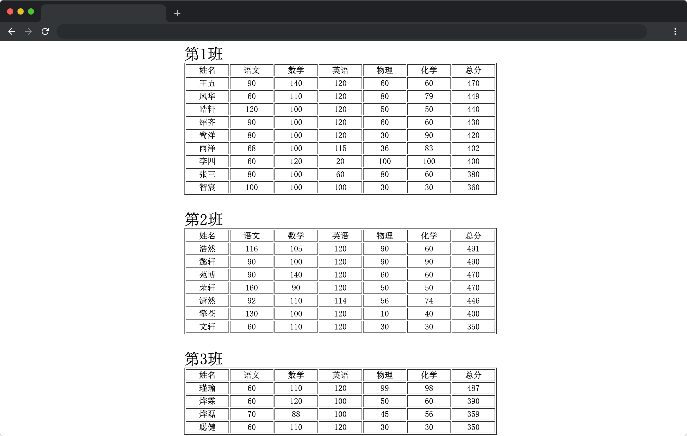

# 分阵营，比高低

## 介绍

期末考试结束不久，辛勤的园丁们就将所有学生的考试成绩汇总完毕。不过现在遇到一个问题，那就是目前所有学生的考试数据均混杂在一起。这些数据结构如下：

```js
[
  {
    name: "潇然",
    class: 2, // 班级
    math: 110, // 数学成绩
    language: 92, // 语文成绩
    english: 114, // 英语成绩
    physics: 56, // 物理成绩
    chemistry: 74, // 化学成绩
  },
  {
    name: "张三",
    class: 1,
    math: 100,
    language: 80,
    english: 60,
    physics: 80,
    chemistry: 60,
  },
  // ...
];
```

从上面的数据结构来看，老师们很难从中分辨出自己班级的学生，更不用说班级学生的成绩排名了。因此我们需要封装一个用于处理这些数据对工具函数，以便帮助老师们更好的查看自己班级的学生成绩。

## 准备

本题已经内置了初始代码，打开实验环境，目录结构如下：

```txt
├── index.html
└── student-grade.js
```

其中：

- `index.html` 是主页面。
- `student-grade.js` 是待补充的 js 文件。

## 目标

补充文件 `student-grade.js` 中的 `orderStudentGrade` 工具函数，访问 `index.html` 页面会按照不同的班级，且班级内降序排列所有学生的成绩。最终效果如下：



具体功能说明：

- 接收所有学生成绩的数组。
- 将学生按不同的班级分组，且班级内按照总分降序排列（如果学生 A、B 的总分相同，则按照学生在原数据中的先后顺序进行排列，不要在学生成绩的数据对象中添加多余的字段，确保排序后的对象和排序前一致）。
- 返回分班排序后的对象（如果传入的学生成绩列表为空，则返回一个空对象），形如：

```js
// 返回的结果对象：
// key 是班级号，同一个班级中学生成绩降序排列
{
  1: [
    {
      name: "潇然",
      class: 1,
      math: 110,
      language: 92,
      english: 114,
      physics: 56,
      chemistry: 74,
    },
    {
      name: "张三",
      class: 1,
      math: 10,
      language: 8,
      english: 60,
      physics: 8,
      chemistry: 60,
    },
    // ...
  ],
  2: [
    // ...
  ],
};
```

## 规定

- 题目使用 JavaScript 完成，不得使用第三方库。
- 只能在 `student-grade.js` 中指定区域答题，不能修改 `index.html` 中的任何代码。
- 请不要修改环境自动生成的 `student-grade.js` 以及 `index.html` 文件的文件路径以及文件名。
- 检测时使用的输入数据与题目中给出的示例数据可能是不同的。考生的程序必须是通用的，不能只对需求中给定的数据有效。

## 判分标准

- 本题完全实现题目目标得满分，否则得 0 分。
