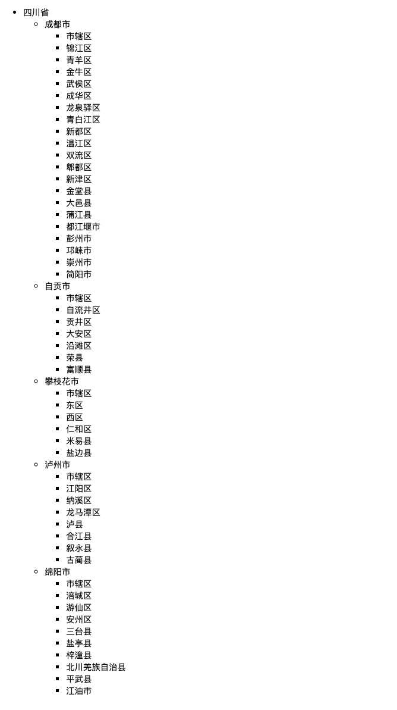

# 平地起高楼

## 介绍

我们的国家国土面积十分的广阔，目前中国有 34 个省级行政区，包括 23 个省、5 个自治区、4 个直辖市、2 个特别行政区。其下面还有几千个县级区域，以及更多的乡镇区域。

这样层层嵌套的省市区数据在实际开发中是如何处理的呢？下面请运用所学，解开这个谜团吧～

## 准备

本题已经内置了初始代码，打开实验环境，目录结构如下：

```bash
├── convert-to-tree.js
└── index.html
```

其中：

- `index.html` 是主页面。
- `convert-to-tree.js` 是需要补充代码的 js 文件。

## 目标

在实际开发中，由于省市区等层级较多，使得数据结构按照嵌套关系来存储则过于复杂，一般在数据库中会将省市区数据解耦，每条信息以并列关系存储在一张表中，结构如下：

```js
[
  {
    id: "51", // 区域 id
    name: "四川省", // 区域名字
    pid: "0", // 区域的父级区域 id
  },
  {
    id: "5101",
    name: "成都市",
    pid: "51", // 成都的父级是四川省，所以 pid 是 51
  },
  // ...
];
```

各级行政区域通过 `pid` 关联起来。

但是这样平铺的数据放在前端页面展示的话，用户很难看出其中的层级关系，所以需要将平铺的结构转化为树状结构，便于前端展示：

```js
[
  {
    id: "51", // 地址 id
    name: "四川省", // 地址名
    pid: "0", // 该地址的父节点 id
    children: [
      {
        id: "5101",
        name: "成都市",
        pid: "51",
        children: [
          {
            id: "510101",
            name: "市辖区",
            pid: "5101",
            children: [], // 如果该区域节点没有子集，children 则为空数组！！！
          },
          // ...
        ],
      },
      // ...
    ],
  },
  // ...
];
```

补充文件 `convert-to-tree.js` 中的 `convertToTree` 工具函数，使其实现我们需要的功能：



- 接收平铺的区域信息数组，并将其转化为树状结构，最终数据结构如上面介绍中所示（树状结构，且对于没有子集的叶子节点，其 children 属性设置为空数组）。
- 并且还接收一个 `rootId`，用于标识返回哪一个区域下面的所有节点。默认为 `0` 表示返回所有省份信息（在我们的示例数据中，所有省份的 `pid` 都为 `0`）。

完成后，最终页面效果如下：


## 规定

- 题目使用 JavaScript 完成，不得使用第三方库。
- 只能在 `convert-to-tree.js` 中指定区域答题，不能修改 `index.html` 中的任何代码。
- 请不要修改环境自动生成的 `convert-to-tree.js` 以及 `index.html` 文件的文件路径以及文件名。
- 检测时使用的输入数据与题目中给出的示例数据可能是不同的。考生的程序必须是通用的，不能只对需求中给定的数据有效。
- 满足题目需求后，点击「提交检测」系统会自动判分。

## 判分标准

- 本题完全实现题目目标得满分，否则得 0 分。
