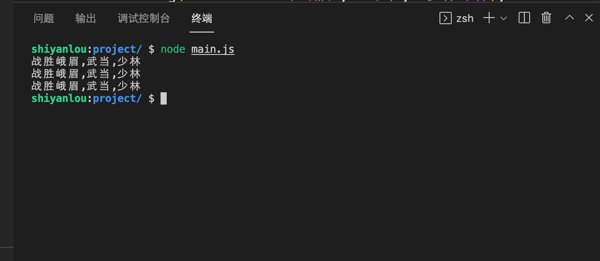

# 乾坤大挪移心法

## 介绍

六大派围攻光明顶，为解除明教危机，张无忌临危受命，在小昭的帮助下进入明教圣地拿到乾坤大挪移心法。在这关键时刻，心法因没有妥善保存长久暴露在空气中，部分字体已不可见，下面需要由你来设计心法帮助张无忌习得神功，战胜六大门派。

## 准备

题目已经内置了代码，打开实验环境，选中 `main.js` 文件

## 目标

找到 `main.js` 文件中的“乾坤大挪移心法” `mentalMethod` 函数，完成函数中的 TODO 部分。

1. `mentalMethod` 需要返回一个函数，可以一直进行调用，但是最后一次调用不传参。
2. 函数通过以下方式执行，返回结果均为 `'战胜峨眉,武当,少林'`。

```
mentalMethod('峨眉')('武当')('少林')();
mentalMethod('峨眉','武当')('少林')();
mentalMethod('峨眉','武当','少林')();
```

> 注意逗号为英文逗号。

完成后，在命令行输入 `node main.js` 效果如下：



## 规定

- 请严格按照考试步骤操作，切勿修改考试默认提供项目中的文件名称、文件夹路径等。
- 满足题目需求后，点击「提交检测」系统会自动判分

## 判分标准

- 本题完全实现题目目标得满分，否则得 0 分。
