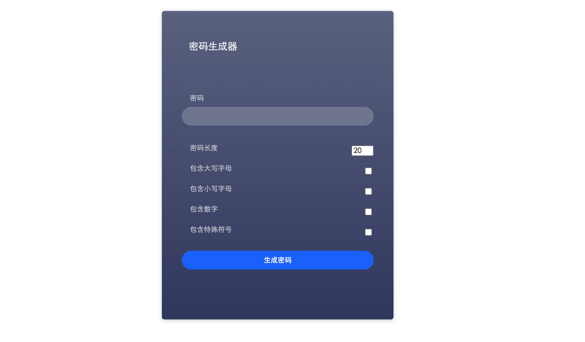
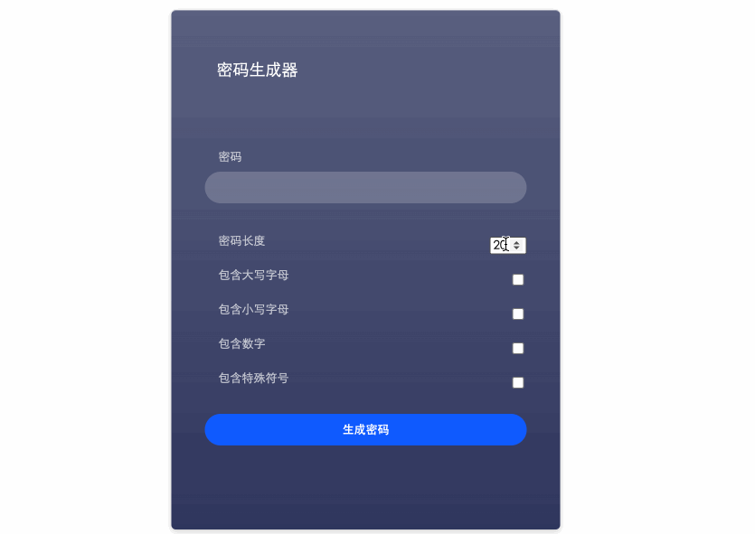

# 不能说的秘密

## 介绍

密码生成器是一个实用的随机密码生成软件，有了它，你就不用绞尽脑汁想复杂的密码来守护你的个人隐私，只要动一下手指，一个新的密码就会生成。

如此好用的工具，下面就让我们亲自动手来制作一个吧～

## 准备

本题已经内置了初始代码，打开实验环境，目录结构如下：

```txt
├── css
│   └── style.css
├── index.html
└── js
    └── generatePassword.js
```

其中：

- `css/style.css` 是样式文件。
- `index.html` 是主页面。
- `js/generatePassword.js` 是需要补充代码的 js 文件。

选中 `index.html` 右键启动 Web Server 服务（Open with Live Server），让项目运行起来。

接着，打开环境右侧的【Web 服务】，就可以在浏览器中看到如下效果：



## 目标

请完善 `generatePassword.js` 中的 `generatePassword` 函数，实现根据规则随机生成密码的功能。密码长度已由 input 框（`id=passwordLength`）的属性进行了限制最小 4，最大 20。

1. 生成的密码必须包含已选中的选项且只能由已选中的选项组成。
2. 特殊符号如下：`!@#$%^&*(){}[]=<>/,.` 。
3. 本题封装方法时只需要考虑长度符合要求（ 4-20 ）且有已选中条件的情况，其他情况无需处理。

完成后，最终页面效果如下：



## 规定

- 生成的密码必须是随机的。
- 满足题目需求后，保持 Web 服务处于可以正常访问状态，点击「提交检测」系统会自动判分。

## 判分标准

- 本题完全实现题目目标得满分，否则得 0 分。
