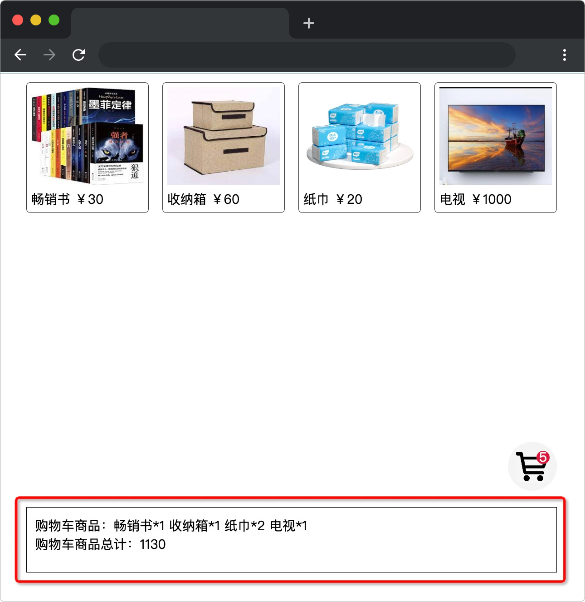
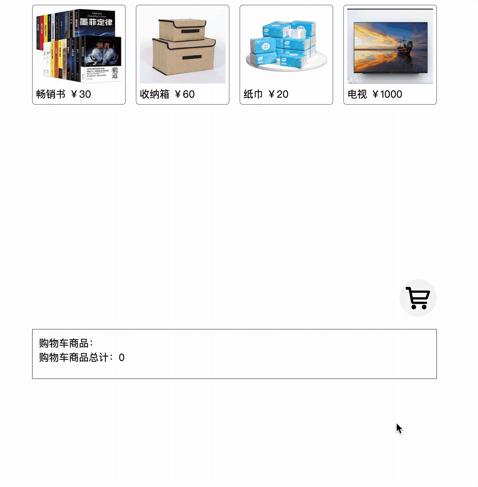

# 趣购

## 介绍

在线购物几乎已经是现代生活必备的一环，每年的 618，双 11 都是购物的狂欢。我们几乎可以在线上购物商城买到一切日常所需。

本题需要在已提供的基础项目中，使用 Web 原生拖拽事件实现在线购物的功能。

## 准备

开始答题前，需要先打开本题的项目代码文件夹，目录结构如下：

```txt
├── images
│   ├── book.jpeg
│   ├── box.jpeg
│   ├── paper.jpeg
│   ├── trolley.jpeg
│   └── tv.jpg
├── index.html
├── effect.gif
├── js
│   ├── http-vue-loader.js
│   └── vue.min.js
└── trolley.vue
```

其中：

- `index.html` 是主页面。
- `effect.gif` 是最终实现的效果图。
- `images` 文件夹提供的页面所需要的商品图片。
- `js/vue.min.js`、`js/http-vue-loader.js` 是 vue 库相关文件。
- `trolley.vue` 是需要补充代码的组件文件。

注意：打开环境后发现缺少项目代码，请复制下述命令至命令行进行下载。

```bash
cd /home/project
wget https://labfile.oss.aliyuncs.com/courses/18164/08.zip && unzip 08.zip && rm 08.zip
```

在浏览器中预览 `index.html` 页面，显示如下所示：



## 目标

请在 `trolley.vue` 文件中的 TODO 部分补全代码：

- 用鼠标按下拖动图片到购物车（即 `id="trolley"` 的节点）中，然后松开鼠标，购物车会添加拖动的商品，并显示购物车商品数量。
- 下方（即 `class="result"` 的方框）会显示购物车中商品的详情，详情以**商品名 x 数量**的形式展示，商品之间通过空格间隔。
- 下方（即 `class="result"` 的方框）同时还会显示购物车中商品的总价。


完成后的效果见文件夹下面的 gif 图，图片名称为 `effect.gif`（提示：可以通过 VS Code 或者浏览器预览 gif 图片）:



题目会用到的拖拽 API 参考：

全局属性 draggable 是一个枚举类型的属性，用于标识元素是否允许使用拖放操作拖动。它的取值如下：

- `true`：表示元素可以被拖动。
- `false`：表示元素不可以被拖动。

带有属性 `draggable` 的可拖放元素可用的拖放事件 api 如下：

拖动事件：

| 事件        | 事件处理程序  | 触发时刻                                           |
| ----------- | ------------- | -------------------------------------------------- |
| `drag`      | `ondrag`      | 当拖拽元素或选中的文本时触发。                     |
| `dragstart` | `ondragstart` | 当用户开始拖拽一个元素或选中的文本时触发           |
| `dragend`   | `ondragend`   | 当拖拽操作结束时触发 (比如松开鼠标按键或敲“Esc”键) |

放置事件：

| 事件        | 事件处理程序  | 触发时刻                                                                                                             |
| ----------- | ------------- | -------------------------------------------------------------------------------------------------------------------- |
| `dragenter` | `ondragenter` | 当拖拽元素或选中的文本到一个可释放目标时触发                                                                         |
| `dragleave` | `ondragleave` | 当拖拽元素或选中的文本离开一个可释放目标时触发。                                                                     |
| `dragover`  | `ondragover`  | 当元素或选中的文本被拖到一个可释放目标上时触发（每 100 毫秒触发一次）                                                |
| `drop`      | `ondrop`      | 当元素或选中的文本在可释放目标上被释放时触发，想要 `ondrop` 能正确触发，有时需要在前置 `dragover` 事件中禁用默认行为 |

每个 `drag` event 都有一个 `dataTransfer` 属性，其中保存着事件的数据。这个属性（`DataTransfer` 对象）也有管理拖拽数据的方法。`setData()` 方法为拖拽数据添加一个项，其用法如下所示：

```js
function dragstart_handler(ev) {
  // 添加拖拽数据，key 可以为任意字符串
  ev.dataTransfer.setData("key", "value");
  const data = ev.dataTransfer.getData("key");
}
```

## 规定

- 请勿修改 `trolley.vue` 文件外的任何内容。
- 请严格按照考试步骤操作，切勿修改考试默认提供项目中的文件名称、文件夹路径、class 名、id 名、图片名等，以免造成无法判题通过。
- 满足需求后，保持 Web 服务处于可以正常访问状态，点击「提交检测」系统会自动检测。


## 判分标准

- 本题完全实现题目目标得满分，否则得 0 分。
