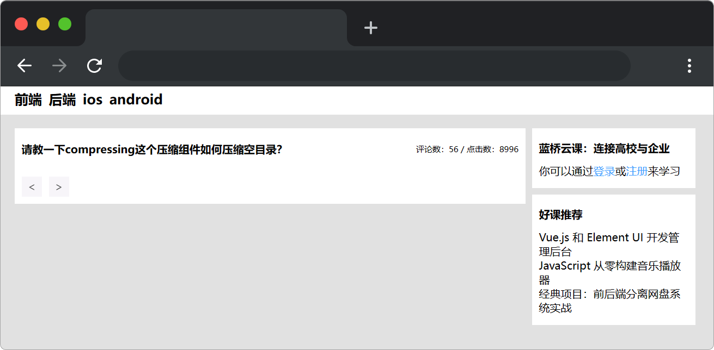

# 分页组件

## 介绍

分页组件是常用的组件，通过使用分页组件减少后端的查询时间，不会因为数据加载过多影响页面显示性能。本题需要在已提供的基础项目中，完成一个分页组件。

## 准备

开始答题前，需要先打开本题的项目代码文件夹，目录结构如下：

```text
├── effect.gif 
├── css
│   └── index.css
├── index.html
└── js
    ├── data.json
    ├── axios.min.js
    ├── util.js
    └── index.js
```

其中：

- `index.html` 是主页面。
- `js/index.js` 是待完善的 js 文件。
- `js/data.json` 是存放数据的 json 文件。
- `js/axios.min.js` 是 axios 文件。
- `js/util.js` 是存放工具方法 util 文件。
- `css/index.css` 是 css 样式文件。
- `effect.gif` 是完成的效果图。

注意：打开环境后发现缺少项目代码，请复制下述命令至命令行进行下载。

```shell
cd /home/project
wget -q https://labfile.oss.aliyuncs.com/courses/18164/test5.zip
unzip test5.zip && rm test5.zip
```

在浏览器中预览 `index.html` 页面，显示如下所示：



## 目标

请在 `js/index.js` 和 `js/util.js` 文件中补全代码。

最终效果可参考文件夹下面的 gif 图，图片名称为 `effect.gif `（提示：可以通过 VS Code 或者浏览器预览 gif 图片）。


具体需求如下：

1. 补全 `js/index.js` 中的 `ajax` 函数，完成数据请求（数据来源 `./js/data.json`），`data.json` 中存放的数据为 100 条文章标题，点击和评论量。根据函数参数获得当前页的数据和总页数，并最终返回（即 `return`）。在项目目录下已经提供了 axios，考生可自行选择是否使用。

其中 `ajax` 函数的参数列表说明如下：

|参数名|描述|
|----|-----|
|url|接口地址|
|method|请求方式|
|data|可选，请求接口所需传递的参数|
|query|分页请求时所需的参数对象，`currentPage` 属性为当前页码，`pageSize` 为每页显示条目个数|

`ajax` 函数返回的数据格式如下：

```js
result = {
    data:[{
            "id": 1001,
            "title": "让我们一起写一个前端监控系统吧！",
            "replayCount": 14,
            "clickCount": 3612
        },
        {
            "id": 1002,
            "title": "花了一天的时间，地板式扫盲了vue3所有API盲点",
            "replayCount": 21,
            "clickCount": 9812
        }
        ...
    ],
    total:10 // 总页数，根据不同的 pageSize 由后端算出，目前写死为 10 页，每页传递10条数据
}
```

2. 补全 `js/index.js` 中的 `initEvents` 函数，给分页组件的按钮绑定事件。要求如下：
- 点击 "<" 按钮时，当前页码 `this.currentPage` 在原基础上减 1，最小为 1。
- 点击 ">" 按钮时，当前页码 `this.currentPage` 在原基础上加 1，最大为 `this.totalPages`。
- `this.currentPage` 值改变时，页面上的分页组件效果同步更新。

3. 补全 `js/util.js` 中的 `createPaginationIndexArr` 函数，根据**函数参数**按照**一定规则**生成分页数组 `indexArr` 并返回（即 `return`）。

其中 `createPaginationIndexArr` 函数的参数列表说明如下：

|参数名|描述|
|----|-----|
|currentPage|当前页数|
|totalPages|总的页码数|
|pagerCount|最多页码按钮数|

生成分页数组的规则如下所示：

- 特殊情况：`totalPages<=pagerCount`

|测试数据 1 |totalPages：5 pagerCount：5  |测试数据 2 |totalPages：3 pagerCount：5  |
| -------- |-------- | -------- |-------- |
|**currentPage**        | **indexArr** |**currentPage**        | **indexArr** |
|1,2,3,4,5    |[1,2,3,4,5] |1,2,3   |[1,2,3] |

- 正常情况：`totalPages>pagerCount`

| 测试数据 1  | totalPages：14 pagerCount：5 |测试数据 2        |totalPages：10 pagerCount：5  |测试数据 3 |totalPages：10 pagerCount：6  |
| --------   | -------- | -------- | -------- |-------- | -------- |
| **currentPage**        | **indexArr** | **currentPage**        | **indexArr** | **currentPage**        | **indexArr** |
| 1,2,3      |[1,2,3,4,14]  |1,2,3      |[1,2,3,4,10] |1,2,3,4     |[1,2,3,4,5,10] |
| 4      |[1,3,4,5,14]  |4      |[1,3,4,5,10]  |5      |[1,3,4,5,6,10] |   |  |    |   |
| 5      |[1,4,5,6,14]  |5      |[1,4,5,6,10] |6      |[1,4,5,6,7,10] |   |  |    |   |
| 6      |[1,5,6,7,14] |6      |[1,5,6,7,10] |7,8,9,10     |[1,6,7,8,9,10]| |   |  |    |   |
| 7      |[1,6,7,8,14]  |7      |[1,6,7,8,10]  |  | |
| 8      |[1,7,8,9,14]  |8,9,10      |[1,7,8,9,10]  |      |  |
| 9      |[1,8,9,10,14]  | | | | |
| 10      |[1,9,10,11,14]  |    | |   | |
| 11      |[1,10,11,12,14]  |     |  | |  |
| 12,13,14      | [1,11,12,13,14] |      | | |  |

> 注意：`createPaginationIndexArr` 函数检测时使用的输入数据与题目中给出的示例数据可能是不同的。考生的程序必须是通用的，不能只对需求中给定的数据有效。

4. 补全 `js/index.js` 中的 `renderPagination` 函数，根据 `indexArr` 数组生成分页组件的字符串模板 `template`。规则如下：

```js
/*
当 currentPage =1，indexArr = [1, 2, 3, 4, 10] 时，生成的字符串模板 template 如下，
其中当前页 class 含有 active ，如果前后两个数据并非连续的该元素节点 innerText 值为 ... 并且 class 含有 more
*/ 
template = `<li class="number active">1</li>
<li class="number ">2</li>
<li class="number ">3</li>
<li class="number ">4</li>
<li class="number more">...</li>
<li class="number ">10</li>`


/*  当 currentPage =6，indexArr = [1, 5, 6, 7, 10] 时，生成的字符串模板 template 为 */
template = `<li class="number ">1</li>
<li class="number more">...</li>
<li class="number ">5</li>
<li class="number active">6</li>
<li class="number ">7</li>
<li class="number more">...</li>
<li class="number ">10</li>`

/* 以下为当前页和 li 元素节点 innerText 的关系 */
{
    1: [1, 2, 3, 4, "...", 10],
    2: [1, 2, 3, 4, "...", 10],
    3: [1, 2, 3, 4, "...", 10],
    4: [1, "...", 3, 4, 5, "...", 10],
    5: [1, "...", 4, 5, 6, "...", 10],
    6: [1, "...", 5, 6, 7, "...", 10],
    7: [1, "...", 6, 7, 8, "...", 10],
    8: [1, "...", 7, 8, 9, 10],
    9: [1, "...", 7, 8, 9, 10],
    10: [1, "...", 7, 8, 9, 10],
}
```

## 规定

- 请勿修改 `js/index.js` 文件外的任何内容。
- 请严格按照考试步骤操作，切勿修改考试默认提供项目中的文件名称、文件夹路径、class 名、id 名、图片名等，以免造成无法判题通过。
- `createPaginationIndexArr` 函数检测时使用的输入数据与题目中给出的示例数据可能是不同的。考生的程序必须是通用的，不能只对需求中给定的数据有效。
- 满足需求后，保持 Web 服务处于可以正常访问状态，点击「提交检测」系统会自动检测。

## 判分标准

- 完成目标 1，得 4 分。
- 完成目标 2，得 3 分。
- 完成目标 3，得 9 分。
- 在目标 3 的基础上完成目标 4，得 9 分。
