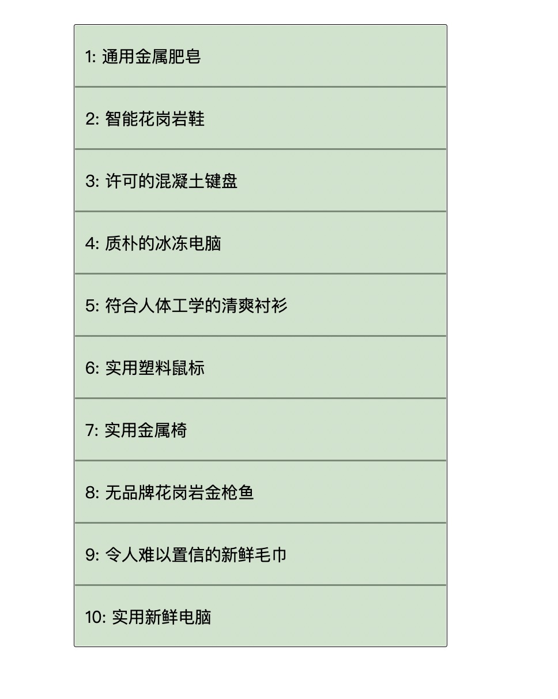
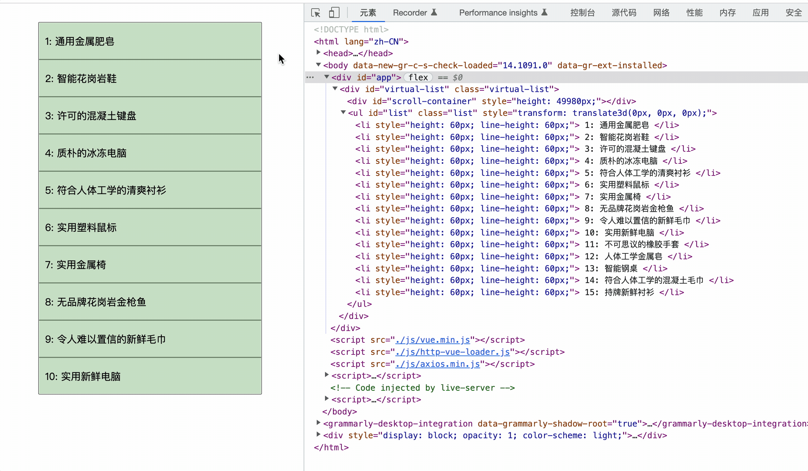

# 虚拟滚动列表

## 介绍

虚拟列表其实是按需显示的一种实现，即只对可见区域进行渲染，对非可见区域中的数据不渲染或部分渲染的技术，从而达到极高的渲染性能。 比较适用于数目较多但体量不大的数据渲染应用场景，后端接口可一次性返回条数较多的数据，避免向服务器频繁地发送 http 请求去多次获取，比如新闻标题列表f。

假设接口一次性返回了 1 万条记录，我们屏幕的可见区域的高度为 500px，而列表项的高度为 50px，则此时我们在屏幕中最多只能看到 10 个列表项，在不考虑分页的情况下，如果我们一次性渲染 1 万个 DOM 节点，性能开销会非常大。 如果在首次渲染的时候，我们只需加载 10 条，渲染就会变得非常快：



并且当滚动发生时，我们可以通过计算当前滚动值得知此时在屏幕可见区域应该显示的列表项

假设滚动发生，滚动条距顶部的位置为 150px，则我们可通过计算得知在可见区域内的列表项为 **第 4 项至第 13 项**：


虚拟列表的实现，实际上就是在首屏加载的时候，只加载可视区域内需要的列表项，当滚动发生时，通过动态计算获得可视区域内的列表项，并将非可视区域内已存在的列表项删除：

- 计算当前可视区域起始数据索引（`startIndex`）。
- 计算当前可视区域结束数据索引（`endIndex`）。
- 计算当前可视区域的数据，并渲染到页面中。
- 计算（`startIndex`）对应的数据在整个列表中的偏移位置（`startOffset`）并设置到列表上。


由于只是对可视区域内的列表项进行渲染，所以为了保持列表容器的高度并可正常的触发滚动，故将 DOM 结构固定如下：

```html
<div class="infinite-list-container">
    <div class="infinite-list-phantom"></div>
    <div class="infinite-list">
      <!-- item-1 -->
      <!-- item-2 -->
      <!-- ...... -->
      <!-- item-n -->
    </div>
</div>
```

上面的 DOM 结构中：
`infinite-list-container` 为视区域的容器。
`infinite-list-phantom` 为容器内的占位，高度为总列表高度，用于形成滚动条。
`infinite-list` 为列表项的渲染区域。

## 准备

开始答题前，需要先打开本题的项目代码文件夹，目录结构如下：

```txt
├── index.html
├── data.json
├── virtual-scroll-list.vue
├── effect.gif
└── js
    ├── axios.min.js
    ├── http-vue-loader.js
    └── vue.min.js
```

其中：

- `index.html` 是主页面。
- `data.json` 是需要请求的数据文件。
- `virtual-scroll-list.vue` 是需要补充代码的组件文件。
- `effect.gif` 是实现的效果图。
- `js/vue.min.js`，`js/http-vue-loader.js` 是 vue 库相关文件。
- `js/axios.min.js` 是请求库 axios 文件。

注意：打开环境后发现缺少项目代码，请复制下述命令至命令行进行下载。

```bash
cd /home/project
wget https://labfile.oss.aliyuncs.com/courses/18164/09.zip && unzip 09.zip && rm 09.zip
```

在浏览器中预览 `index.html` 页面，初始效果是一个空的列表框。

## 目标

请在 **`virtual-scroll-list.vue`** 文件中补全代码，最终实现虚拟列表的功能：

1. 在组件渲染后，实现异步数据读取和渲染功能，使用 `axios` 请求 `data.json` 的数据并填充，数据填充后：
 
  
2. 绑定滚动事件，实现根据滚动区域按需渲染，而非渲染全量 DOM 节点：滚动过程的 DOM 变化可参考文件夹下面的 gif 图，图片名称为 `effect.gif`（提示：可以通过 VS Code 或者浏览器预览 gif 图片）：


## 规定

- 请勿修改 `virtual-scroll-list.vue` 文件外的任何内容。
- 请严格按照考试步骤操作，切勿修改考试默认提供项目中的文件名称、文件夹路径、class 名、id 名、图片名等，以免造成无法判题通过。
- 满足需求后，保持 Web 服务处于可以正常访问状态，点击「提交检测」系统会自动检测。


## 判分标准

- 完成目标 1，得 5 分。
- 完成目标 2，得 20 分。
