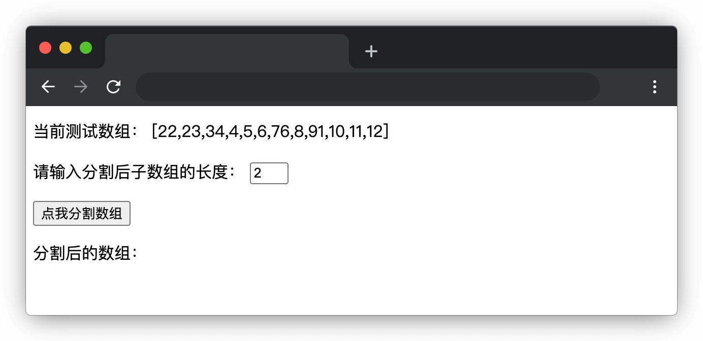

# 分一分

## 介绍

如果给你**一个数组**，你能很快**将它分割成指定长度的若干份**吗？

本题需要在已提供的基础项目中使用 JS 知识封装一个函数，达到分割数组的要求。

## 准备

开始答题前，需要先打开本题的项目代码文件夹，目录结构如下：

```txt
├── effect.gif
├── index.html
└── js
    └── index.js
```

其中：

- `effect.gif` 是最终实现的效果图。
- `index.html` 是主页面。
- `js/index.js` 是需要补充代码的 js 文件。

注意：打开环境后发现缺少项目代码，请手动键入下述命令进行下载：

```bash
cd /home/project
wget https://labfile.oss.aliyuncs.com/courses/9788/01.zip && unzip 01.zip && rm 01.zip
```

在浏览器中预览 `index.html` 页面，显示如下所示：



## 目标

请在 **`js/index.js`** 文件中补全函数 **`splitArray`** 中的代码，最终返回按指定长度分割的数组。

具体要求如下：

1. 将待分割的（一维）数组**升序**排序。
2. 将排序后的数组从**下标为 0** 的元素开始，按照从 **`id=sliceNum`** 的输入框中获取到的数值去分割，并将分割好的数据存入一个新数组中。如：输入框中值为 n，将原数组按每 n 个一组分割，不足 n 个的数据为一组。
3. 将得到的新数组返回（即 **`return`** 一个二维数组）。

例如：

```js
var arr = [3, 1, 4, 2, 5, 6, 7];
// 分割成每 1 个一组
var newA = splitArray(arr, 1);
console.log(newA); // => [[1],[2],[3],[4],[5],[6],[7]]

// 分割成每 2 个一组
newA = splitArray(arr, 2);
console.log(newA); // => [[1,2],[3,4],[5,6],[7]]

// 分割成每 4 个一组
newA = splitArray(arr, 4);
console.log(newA); // => [[1,2,3,4],[5,6,7]]

// 分割成每 7 个一组
newA = splitArray(arr, 7);
console.log(newA); // => [[1,2,3,4,5,6,7]]
```

上述仅为示例代码，判题时会随机提供数组对该函数功能进行检测。

完成后的效果见文件夹下面的 gif 图，图片名称为 `effect.gif`（提示：可以通过 VS Code 或者浏览器预览 gif 图片）。

## 规定

- 请勿修改 `js/index.js` 文件外的任何内容。
- 请严格按照考试步骤操作，切勿修改考试默认提供项目中的文件名称、文件夹路径、class 名、id 名、图片名等，以免造成无法判题通过。

## 判分标准

- 完全实现题目目标得满分，否则得 0 分。
