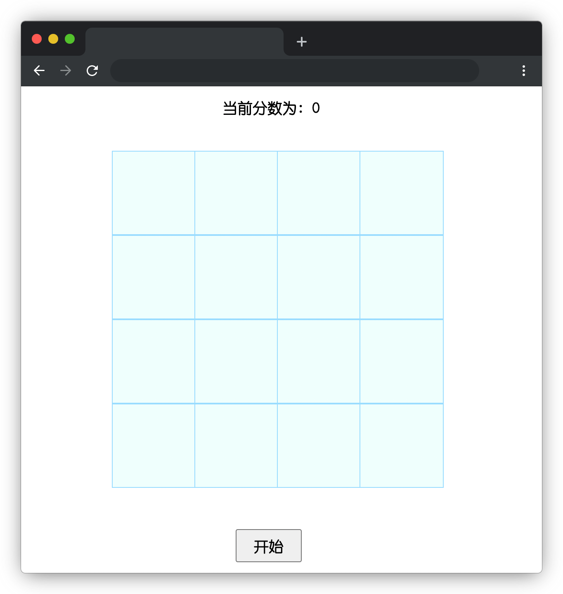

# 水果消消乐

## 介绍

消消乐是一款益智类休闲游戏，在排队等待做核酸的时候可以打开手机玩一会，陪你度过这漫长且无聊的等待期。

本题需要实现一款水果消消乐的游戏，在 4 X 4 的格子上，消除相同的水果得两分，否则扣两分，考验一下大家的记忆力，看看最后谁的分数最多。

## 准备

开始答题前，需要先打开本题的项目代码文件夹，目录结构如下：

```txt
├── css
│   └── style.css
├── images
│   ├── apple.png
│   ├── cherry.png
│   ├── grape.png
│   ├── peach.png
│   ├── pear.png
│   ├── strawberry.png
│   ├── tangerine.png
│   └── watermelon.png
├── js
│   ├── index.js
│   └── jquery-3.6.0.min.js
├── effect.gif
└── index.html
```

其中：

- `css/style.css` 是样式文件。
- `images` 是图片文件夹。
- `js/index.js` 是实现游戏功能的 js 文件。
- `js/jquery-3.6.0.min.js` 是 jQuery 文件。
- `effect.gif` 是最终实现的效果动图。
- `index.html` 是主页面。

注意：打开环境后发现缺少项目代码，请手动键入下述命令进行下载：

```bash
cd /home/project
wget https://labfile.oss.aliyuncs.com/courses/9788/03.zip && unzip 03.zip && rm 03.zip
```

在浏览器中预览 `index.html` 页面，点击开始按钮不能正常进行游戏，效果如下：



## 目标

请完善 `js/index.js` 文件。

完成后的效果见文件夹下面的 gif 图，图片名称为 `effect.gif`（提示：可以通过 VS Code 或者浏览器预览 gif 图片）。

具体说明如下：

- 点击**开始**按钮后，该按钮被隐藏，方格上的图片显示后又隐藏。
- 点击方格，方格中的图片显示，页面显示两张图片后，比较图片是否相同。
- 如果图片上的水果相同，方格即可消除，并得 **2 分**；如果图片上的水果不相同，图片隐藏，并扣 **2 分**（分数可以为负数）。
- 在文本 “当前分数为：” 的冒号后面会**实时**统计当前的得分情况。

## 规定

- 请勿修改 `js/index.js` 文件外的任何内容。
- 请严格按照考试步骤操作，切勿修改考试默认提供项目中的文件名称、文件夹路径、class 名、id 名、图片名等，以免造成无法判题通过。

## 判分标准

- 本题完全实现题目目标得满分，否则得 0 分。
