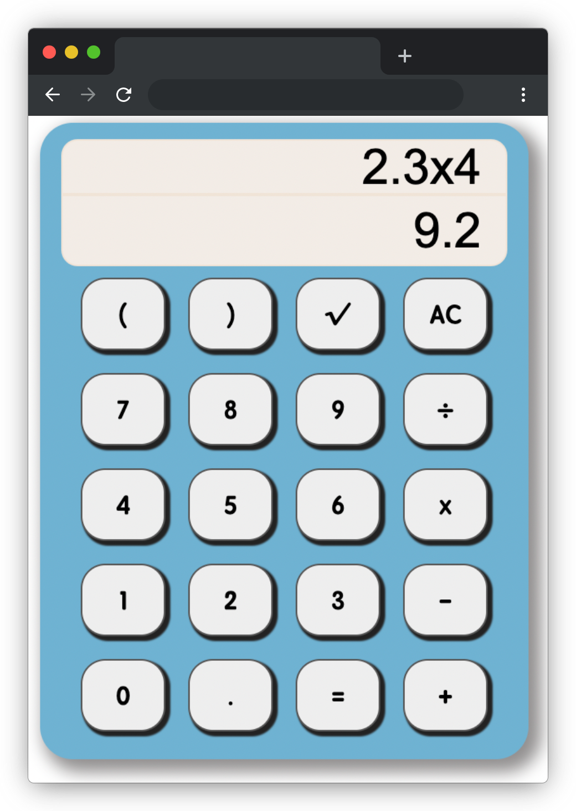

# 用什么来做计算 A

## 介绍

古以算盘作为计算工具。算盘常为木制矩框，内嵌珠子数串，定位拨珠，可做加减乘除等运算。站在前人的肩膀上，后人研究出计算器，便利了大家的生活，我们不用带着笨重的计算工具出门，打开手机上的计算器就可以了。

本题需要实现一个可以进行加减乘除等运算的计算器。

## 准备

开始答题前，需要先打开本题的项目代码文件夹，目录结构如下：

```txt
├── css
│   └── style.css
├── js
│   └── index.js
├── effect.gif
└── index.html
```

其中：

- `css/style.css` 是样式文件。
- `js/index.js` 是实现计算功能的 js 文件。
- `effect.gif` 是最终实现的效果动图。
- `index.html` 是主页面。

注意：打开环境后发现缺少项目代码，请手动键入下述命令进行下载：

```bash
cd /home/project
wget https://labfile.oss.aliyuncs.com/courses/9788/04.zip && unzip 04.zip && rm 04.zip
```

在浏览器中预览 `index.html` 页面，点击计算器上的按钮，不能进行计算（图上的红色文字只是对计算器的功能区域进行说明，无需实现），效果如下：



## 目标

请完善 `js/index.js` 文件，当鼠标点击计算器上的按钮时，能够正常进行计算。

完成后的效果见文件夹下面的 gif 图，图片名称为 `effect.gif`（提示：可以通过 VS Code 或者浏览器预览 gif 图片）。

具体说明如下：

- 点击按钮会在计算式子区域显示当前输入的计算式子，当点击**等号（=）** 后，在结果显示区域应该显示出正确的结果。
- 计算器需要具有**加（+）**、**减（-）**、**乘（x）**、**除（÷）**、**开二次方（√）**、**重置（AC）**、**小数点（.）**、**括号运算**这八个功能。
- 计算器的计算遵循四则混合运算的法则，括号的优先级最高，其次是乘除，加减的优先级最低。

效果说明如下：

- 能够正确进行加、减、乘、除的混合运算，样例如下所示：

  

- 能够正确进行开二次方，输入一个可以平方的数，点击开方（√）按钮即可在结果显示区域显示结果。如果输入的值是不能平方，结果显示 NaN，样例如下所示：

  

  

- 点击重置按钮（AC），可以清空计算式子显示区域和结果显示区域的值。
- 能够进行小数的加减乘除运算，样例如下所示：

  

## 规定

- 请勿修改除 `js/index.js` 文件以外任何文件的内容。
- 请注意，在 `js/index.js` 文件中编写代码时，必须使用文件已经给出的 class 名、id 名、标签来进行 DOM 操作。
- 请严格按照考试步骤操作，切勿修改考试默认提供项目中的文件名称、文件夹路径等，以免造成无法判题通过。

## 判分标准

- 实现重置（AC）功能，得 1 分。
- 实现计算式子和结果显示功能，得 3 分。
- 实现计算功能，得 6 分。
