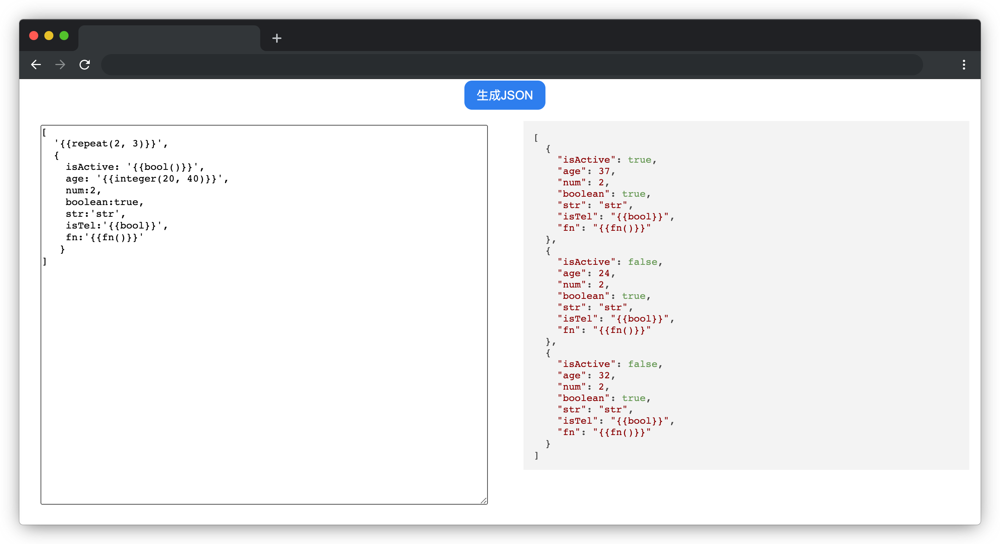

# JSON 生成器

## 介绍

JSON 已经是大家必须掌握的知识点，JSON 数据格式为前后端通信带来了很大的便利。在开发中，前端开发工程师可以借助于 JSON 生成器快速构建一个 JSON 用来模拟数据。

本题请你开发一个简易的 JSON 生成器工具，使它能根据模板生成对应格式的 JSON 。

## 准备

开始答题前，需要先打开本题的项目代码文件夹，目录结构如下：

```txt
├── css
├── index.html
└── js
    ├── highlight.min.js
    └── index.js
```

其中：

- `css` 是样式文件夹。
- `index.html` 是主页面。
- `js/highlight.min.js` 是 `json` 格式化文件。
- `js/index.js` 是需要补充代码的 `js` 文件。

注意：打开环境后发现缺少项目代码，请手动键入下述命令进行下载：

```bash
cd /home/project
wget https://labfile.oss.aliyuncs.com/courses/9788/09.zip && unzip 09.zip && rm 09.zip
```

在浏览器中预览 `index.html` 页面效果如下：



## 目标

请在 `index.js` 文件中补全 `generateData` 函数代码，并最终返回一个 js 对象(说明 : `generateData` 生成的数据会由插件自动转化成 `JSON`)。

在左侧的输入框中输入指定格式的数据模板，点击**生成 JSON** 按钮，右侧会自动生成对应格式的 `JSON` 数据。

1. 数据模板中对象的 `key` 对应的 `value` 如果是 `{{}}` 并且符合下述规则，则根据下述规则解析，否则一律返回原始 `value` 值。具体规则如下：

- `{{bool()}}` 表示随机生成布尔值。
- `{{integer(n, m)}}` 表示生成 n-m 之间（包含 n、m ）的随机整数（注意：`n<m`）。


附目标 1 测试用例：

```js
{
  isPass: '{{bool()}}',
  age: '{{integer(3, 5)}}',
  goodsNumber:2,
  isShow:false,
  tag:'phone',
  fn:'{{integer}}'
}
```

2. 数据模板中 `{{repeat()}}`（此项只会出现在数组首位）表示重复生成数组中的数据，如：`"repeat(5, 7)"` 则表示随机生成 `5-7` 条数组数据，`repeat` 中值只包含一个数字，如`"repeat(5)"` 表示生成 `5` 条数组数据。


附目标 2 测试用例(3 组)：

```js
// （1）随机生成 `2-5` 条数组数据
[
  "{{repeat(2, 5)}}",
  {
    isActive: "{{bool()}}",
    age: "{{integer(20, 40)}}",
    num: 2,
    boolean: true,
    str: "str",
    isTel: "{{bool}}",
    fn: "{{fn()}}",
  },
]
// （2）固定生成 `7` 条数组数据
[
  ("{{repeat(7)}}",
  {
    isTrue: "{{bool()}}",
    score: "{{integer(3, 7)}}",
    tag: "android",
    isSamll: true,
    fn: "{{fn()}}",
  })
]
// （3）无 repeat 的情况
[
  { maxNum: 10 }
];
```

**注意**：本题不考虑用户输入和传参不合法的情况，只处理合法的数据格式即可，实际测试中 `key` 和 `value` 为非固定值。提供的测试用例仅为方便测试代码使用，实际使用中需要对所有符合要求的数组/对象结构的模板生效。

## 规定

- 请勿修改 `js/index.js` 文件外的任何内容。
- 请不要使用固定值，如对象的 `key` 只对测试用例的 `key` 生效，以免造成无法判题通过。
- 请严格按照考试步骤操作，切勿修改考试默认提供项目中的文件名称、文件夹路径、class 名、id 名、图片名等，以免造成无法判题通过。

## 判分标准

- 实现目标 1，得 10 分。
- 实现目标 2，得 15 分。
