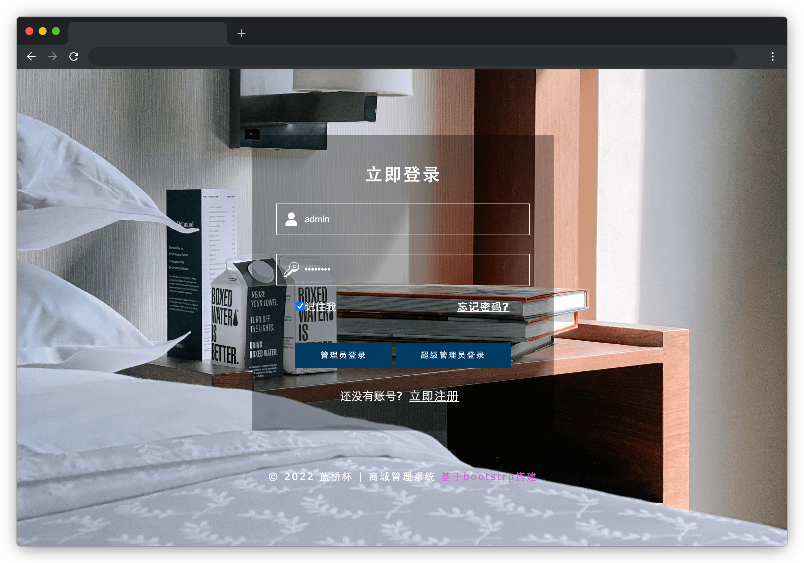

# 商城管理系统

## 介绍

在商城管理系统中，超级管理员和普通管理员因为权限不同，登录进入后看到的菜单也会是不同的。

本题需要你完成商城管理系统中权限数据的处理。

## 准备

开始答题前，需要先打开本题的项目代码文件夹，目录结构如下：

```txt
├── css
├── images
├── js
│   ├── auth.js
│   └── menu.js
├── effect.gif
├── login.html
└── index.html
```

其中：

- `css` 是样式文件夹。
- `images` 是图片文件夹。
- `login.html` 是登录页。
- `index.html` 是商城首页。
- `js/menu.js` 是渲染左侧菜单的 `js` 文件。
- `js/auth.js` 是需要补充代码的 `js` 文件。
- `effect.gif` 是最终完成的效果图。

注意：打开环境后发现缺少项目代码，请手动键入下述命令进行下载：

```bash
cd /home/project
wget https://labfile.oss.aliyuncs.com/courses/9788/10.zip && unzip 10.zip && rm 10.zip
```

在浏览器中预览 **`login.html`** 页面效果如下：



## 目标

请在 `js/auth.js` 文件中补全 `getMenuListAndAuth` 函数代码。

在登录页 `login.html` 点击**管理员登录**和**超级管理员登录**时会根据管理员的权限不同，在商城首页 `index.html` 的左侧显示不同的菜单列表。但是后端同学给的数据是不符合前端展示要求的，所以我们需要做些处理，假如后端提供的数据是这样的:

```js
[
  { parentId: -1, name: "商品管理", id: 1, auth: "cart" },
  { parentId: 1, name: "商品列表", id: 4, auth: "cart-list" },
  { parentId: -1, name: "添加管理员", id: 10, auth: "admin" },
];
```

其中数据中对象字段的含义说明：

- `id` 表示当前节点
- `parentId` 表示父级节点，如果为 `-1` 则表示顶级数据
- `auth` 表示权限

具体需求如下：

1. 将待处理数据（一维数组）根据 `parentId` 字段值处理成树形结构存入 `menus` 变量中。

把数据处理成如下格式（每一项都必须有 `children` 字段，没有子级时，`children` 为空数组）：

```js
[
  {
    parentId: -1,
    name: "商品管理",
    id: 1,
    auth: "cart",
    children: [
      {
        parentId: 1,
        name: "商品列表",
        id: 4,
        auth: "cart-list",
        children: [],
      },
    ],
  },
  {
    parentId: -1,
    name: "添加管理员",
    id: 10,
    auth: "admin",
    children: [],
  },
];
```

**注意**：`js/auth.js` 中的 `menuList` 仅为后端返回的数据结构示例，非固定数据。实际使用中，后端返回的数据转化成树形结构时层级可能更多，封装方法时务必考虑通用性。

2. 将待处理数据中的 `auth` 字段提取出来并存入 `auths` 变量中，左侧菜单会根据传入的权限列表数组和 `auths` 对比后进行菜单渲染。

经过 `getMenuListAndAuth` 处理后 `auths` 的结果为：

```js
["cart", "cart-list", "admin"];
```

完成后的效果见文件夹下面的 gif 图，图片名称为 `effect.gif`（提示：可以通过 VS Code 或者浏览器预览 gif 图片）。

## 规定

- `getMenuListAndAuth` 需要对所有符合规则的数组有效。
- 请严格按照考试步骤操作，切勿修改考试默认提供项目中的文件名称、文件夹路径、class 名、id 名、图片名等，以免造成无法判题通过。

## 判分标准

- `auths` 数组返回值正确，得 5 分。
- `menus` 树形结构返回值正确，得 20 分。
