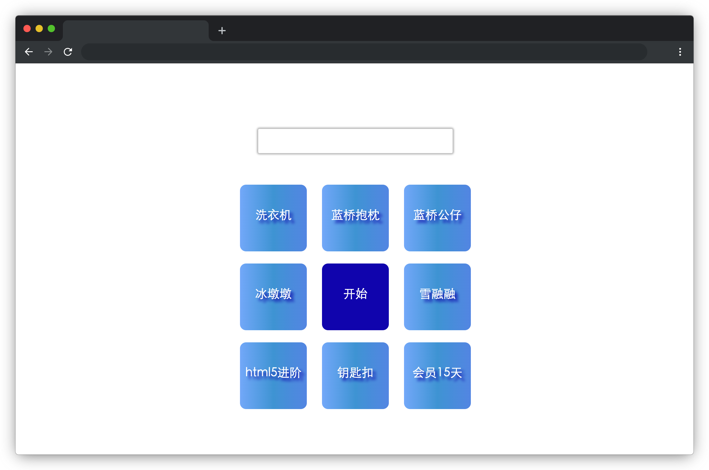

# 冬奥大抽奖

## 介绍

蓝桥云课庆冬奥需要举行一次抽奖活动，我们一起做一个页面提供给云课冬奥抽奖活动使用。

## 准备

开始答题前，需要先打开本题的项目代码文件夹，目录结构如下：

```txt
├── css
│   └── style.css
├── effect.gif
├── index.html
└── js
    ├── index.js
    └── jquery.js
```

其中：

- `css/style.css` 是样式文件 。
- `index.html` 是主页面。
- `js/jquery.js` 是 jQuery 文件。
- `js/index.js` 是需要补充的 js 文件。
- `effect.gif` 是最终实现的效果图。

注意：打开环境后发现缺少项目代码，请手动键入下述命令进行下载：

```bash
cd /home/project
wget https://labfile.oss.aliyuncs.com/courses/9791/05.zip && unzip 05.zip && rm 05.zip
```

在浏览器中预览 `index.html` 页面效果如下：



## 目标

找到 `index.js` 中 `rolling` 函数，使用 `jQuery` 或者 `js` 完善此函数，达到以下效果：

1. 点击开始后，以 `class` 为 `li1` 的元素为起点，黄色背景（`.active` 类）在奖项上顺时针转动。
2. 当转动停止后，将获奖提示显示到页面的 `id` 为 `award` 元素中。获奖提示必须包含奖项的名称，**该名称需与题目提供的名称完全一致**。
3. 转动时间间隔和转动停止条件已给出，请勿修改。

完成后的效果见文件夹下面的 gif 图，图片名称为 `effect.gif`（提示：可以通过 VS Code 或者浏览器预览 gif 图片）。

## 规定

- 转动时间间隔和转动停止条件已给出，请勿修改。
- 请严格按照考试步骤操作，切勿修改考试默认提供项目中的文件名称、文件夹路径等。
- 请勿修改项目中提供的 `id`、`class`、函数名等名称，以免造成无法判题通过。

## 判分标准

- 本题完全实现题目目标得满分，否则得 0 分。
