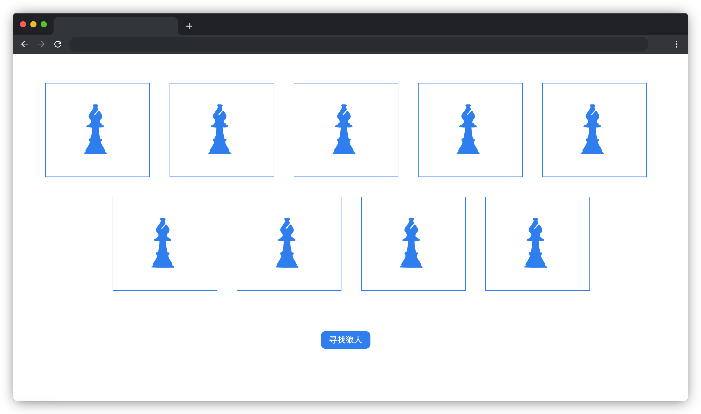

# 寻找小狼人

## 介绍

“狼人杀”是一款多人参与的策略类桌面游戏。本题我们一起完成一个简易的狼人杀游戏，让我们找到其中的狼人。

## 准备

开始答题前，需要先打开本题的项目代码文件夹，目录结构如下：

```txt
├── css
│   └── style.css
├── images
│   └── card.svg
├── index.html
└── js
    └── myarray.js
```

其中：

- `css/style.css` 是样式文件。
- `index.html` 是主页面。
- `images` 是图片文件夹。
- `js/myarray.js` 是需要补充的 js 文件。

注意：打开环境后发现缺少项目代码，请手动键入下述命令进行下载：

```bash
cd /home/project
wget https://labfile.oss.aliyuncs.com/courses/9791/09.zip && unzip 09.zip && rm 09.zip
```

在浏览器中预览 `index.html` 页面效果如下：



## 目标

在本题 `index.html` 已经给出的数组中，我们可以通过数组的 `filter` 方法：`cardList.filter((item) => item.category == "werewolf")` 返回一个都是狼人的新数组。但是技术主管为了考验大家的技术，规定了在代码中任何地方都不能出现 `filter` 关键字。所以我们需要封装一个 `myarray` 方法来实现类似数组 `filter` 的功能。

1. 狼人比较狡猾，筛选狼人的条件可能会变化，例如 `item.name`，请实现一个通用的方法。
2. 完成封装后，页面效果会自动完成，效果见文件夹下 `effect.gif`（请使用 VS Code 或者浏览器打开 gif 图片）。

## 规定

- 禁止在代码中出现 `filter` 关键字。
- 请严格按照考试步骤操作，切勿修改考试默认提供项目中的文件名称、文件夹路径等。
- 请勿修改项目中提供的 `id`、`class`、函数名等名称，以免造成无法判题通过。

## 判分标准

- 本题完全实现题目目标得满分，否则得 0 分。
