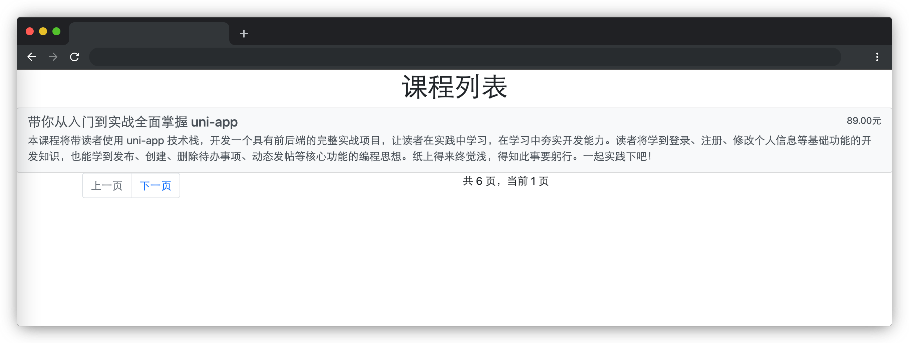

# 课程列表

## 介绍

分页是前端页面中必不可少的一项功能，下面让我们一起来完成一个课程列表的分页吧。

## 准备

开始答题前，需要先打开本题的项目代码文件夹，目录结构如下：

```txt
├── css
│   └── bootstrap.css
├── effect.gif
├── index.html
└── js
    ├── axios.js
    ├── carlist.json
    └── index.js
```

其中：

- `css/bootstrap.css` 是项目中用到 `bootstrap` 样式文件。
- `index.html` 是主页面。
- `js/carlist.json` 是请求需要用到的数据。
- `js/axios.js` 是请求需要用到的 axios 文件。
- `js/index.js` 是需要补充的 js 文件。
- `effect.gif` 是最终效果图。

注意：打开环境后发现缺少项目代码，请手动键入下述命令进行下载：

```bash
cd /home/project
wget https://labfile.oss.aliyuncs.com/courses/9791/10.zip && unzip 10.zip && rm 10.zip
```

请通过 VS Code 中的 live server 插件启动本项目，让项目运行起来，效果如下：



**注意：一定要通过 live server 插件启动项目，避免项目无法访问，影响做题。**

## 目标

1. 完成数据请求（数据来源 `js/carlist.json`）。在项目目录下已经提供了 `axios`，考生可自行选择是否使用。
2. 完成数据分页显示，每页 5 条数据，默认当前页码为第一页（即 `pageNum = 1` ），按照顺序第一页显示 1-5 条，第二页显示 6-10 条，依此类推。将每条数据显示到 `list-group` 元素中。使用已有代码中 `list-group`，不要修改 `list-group` 元素的 DOM 结构。动态渲染时，`list-group` 示例代码可删除。
3. 当页码为第一页时，上一页为禁用状态（`class=disabled`），点击无任何变化。
4. 当页码为最后一页时，下一页为禁用状态（`class=disabled`），点击无任何变化。
5. 在 `id` 为 `pagination` 元素中正确显示**当前页码**和**总页码（即最大页码）**。当前页码变量使用 `pageNum`，总页码变量使用 `maxPage`。请勿修改**当前页码**和**总页码**的变量名称，以免造成判题无法通过。

完成后的效果见文件夹下面的 gif 图，图片名称为 `effect.gif`（提示：可以通过 VS Code 或者浏览器预览 gif 图片）。

## 规定

- 请严格按照考试步骤操作，切勿修改考试默认提供项目中的文件名称、文件夹路径等。
- 请勿修改项目中提供的 `id`、`class`、函数名等名称，以免造成无法判题通过。

## 判分标准

- 本题完成目标 2 给 10 分，完成目标 3、4、5 各给 5 分。
