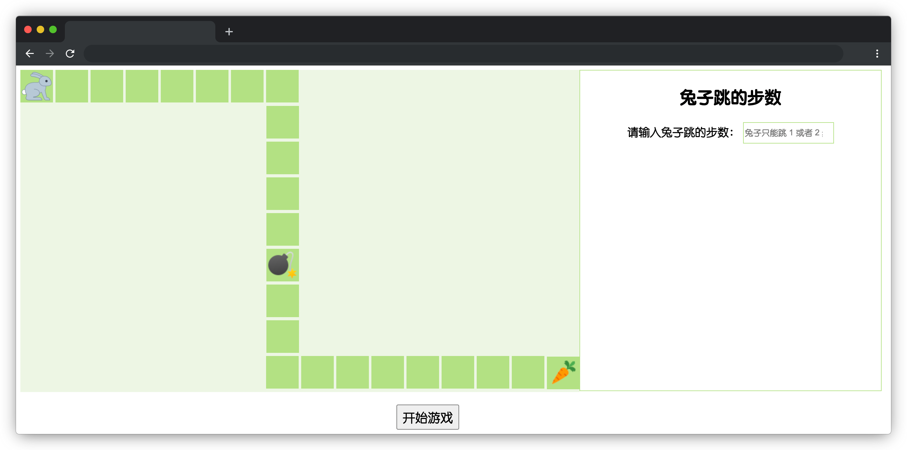

# 小兔子找胡萝卜

## 介绍

本题需要实现一款小兔子找胡萝卜的小游戏。在遥远的兔子王国，有一只小灰兔已经长大了，需要独自去寻找食物。点击“开始游戏”后，在输入框中输入移动步数，点击移动按钮，小灰兔可以在指定形状的草坪上跳动一步或者两步，草坪里藏着炸弹和胡萝卜。如果小灰兔踩到炸弹，本次觅食行动失败；如果小灰兔踩到胡萝卜，本次觅食行动获胜。

## 准备

开始答题前，需要先打开本题的项目代码文件夹，目录结构如下：

```txt
├── css
│   └── style.css
├── images
│   ├── bomb.png
│   ├── carrot.png
│   └── rabbit.png
├── js
│   ├── index.js
│   └── jquery-3.6.0.min.js
├── effect.gif
└── index.html
```

其中：

- `css/style.css` 是样式文件。
- `images` 是图片文件夹。
- `js/index.js` 是实现游戏功能的 js 文件。
- `js/jquery-3.6.0.min.js` 是 jQuery 文件。
- `effect.gif` 是最终实现的效果动图。
- `index.html` 是主页面。

注意：打开环境后发现缺少项目代码，请手动键入下述命令进行下载：

```bash
cd /home/project
wget https://labfile.oss.aliyuncs.com/courses/9790/03.zip && unzip 03.zip && rm 03.zip
```

在浏览器中预览 `index.html` 页面，点击开始游戏按钮没有任何反应，效果如下：



## 目标

请完善 `js/index.js` 文件。

完成后的效果见文件夹下面的 gif 图，图片名称为 `effect.gif`（提示：可以通过 VS Code 或者浏览器预览 gif 图片）。

具体说明如下：

- 点击**开始游戏**的按钮后，**移动按钮**显示，**开始游戏**按钮隐藏，在右侧输入框中输入步数后，点击**移动按钮**，小兔子可以在草坪上向前移动。
- 输入框中只能输入 **1** 或者 **2**，输入其他数字，点击**移动按钮**后，小兔子不会移动，并且在按钮下方（**.result** 元素中）会显示一句话：“**输入的步数不正确，请重新输入。**”。
- 点击**移动按钮**后，输入框中的值不会被清空。
- 如果小兔子踩到第 13 块草坪上的炸弹，**移动按钮**隐藏，**重置按钮**显示，并且在**重置按钮**的下方（**.result** 元素中）会显示一句话：“**哎呀！兔子踩到炸弹了，游戏结束！**”。
- 如果小兔子踩到第 24 块草坪上的胡萝卜，**移动按钮**隐藏，**重置按钮**显示，并且在**重置按钮**的下方（**.result** 元素中）会显示一句话：“**小兔子吃到胡萝卜啦，游戏获胜！**”。
- 点击**重置按钮**小兔子回到游戏的初始化状态，并且输入框中的值和按钮下方的提示文字都会被清空。

## 规定

- 请勿修改 `js/index.js` 文件外的任何内容。
- 请严格按照上述要求来完成代码，按钮下方显示的文本内容，与具体说明里的内容保持一致，不要自定义，以免造成无法判题通过。
- 请严格按照考试步骤操作，切勿修改考试默认提供项目中的文件名称、文件夹路径、class 名、id 名、图片名等，以免造成无法判题通过。

## 判分标准

- 本题完全实现题目目标得满分，否则得 0 分。
