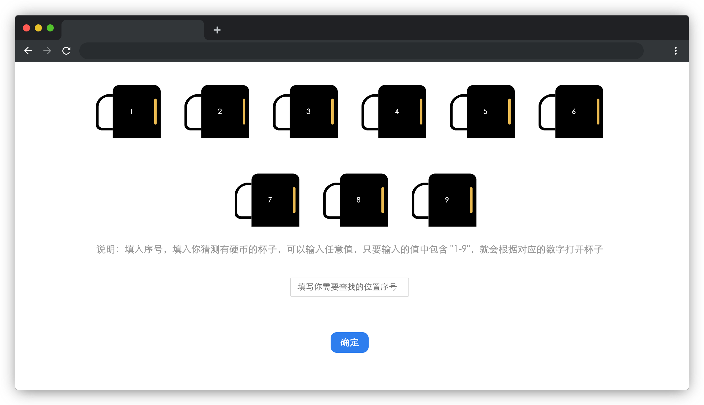

# 猜硬币

## 介绍

为了打发无聊的时间，小蓝开发了一款人机对战的猜硬币游戏，页面中一共有 9 个杯子，系统会随机挑选 3 个杯子在里面放入硬币，玩家通过输入含有杯子序号的字符串进行猜选，但是遇到了一些问题。

本题需要你帮助小蓝完成猜硬币游戏。

## 准备

开始答题前，需要先打开本题的项目代码文件夹，目录结构如下：

```txt
├── css
├── effect.gif
├── images
├── index.html
└── js
    ├── findCoin.js
    └── index.js
```

其中：

- `css` 是样式文件夹。
- `images` 是图片文件夹。
- `index.html` 是主页面。
- `js/index.js` 是硬币渲染和动画逻辑。
- `js/findCoin.js` 是需要补充代码的 js 文件。
- `effect.gif` 是最终实现的效果图。

注意：打开环境后发现缺少项目代码，请手动键入下述命令进行下载：

```bash
cd /home/project
wget https://labfile.oss.aliyuncs.com/courses/9790/04.zip && unzip 04.zip && rm 04.zip
```

在浏览器中预览 `index.html` 页面效果如下：



## 目标

请在 `js/findCoin.js` 文件中补全 `findNum` 和 `randomCoin` 函数代码，最终实现**猜硬币**游戏。

具体需求如下：

1. 页面加载后，系统会在 9 个杯子中随机挑选 3 个杯子生成硬币。
2. 用户在文本框中输入任意字符串，点击**确定**按钮后，系统会找到字符串中含有 `1-9` 的数字，并根据数字打开对应的杯子。

完成后的效果见文件夹下面的 gif 图，图片名称为 `effect.gif`（提示：可以通过 VS Code 或者浏览器预览 gif 图片）。

## 规定

- 请严格按照考试步骤操作，切勿修改考试默认提供项目中的文件名称、文件夹路径、class 名、id 名、图片名等，以免造成无法判题通过。

## 判分标准

- 完成 `findNum` 函数，得 5 分。
- 完成 `randomCoin` 函数，得 5 分。
