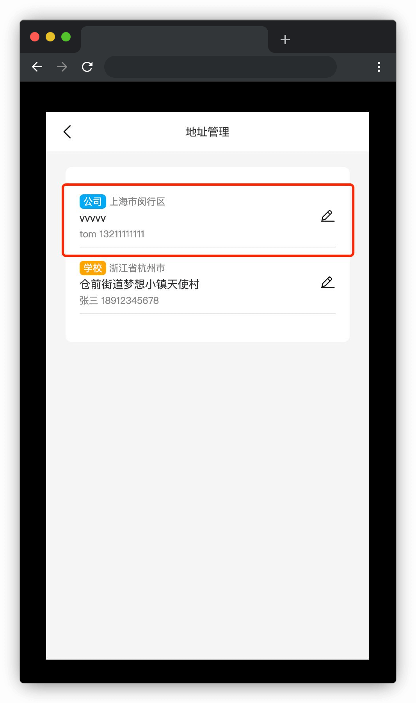

# 新增地址

## 介绍

网购大家应该再熟悉不过，网购中有个很难让人忽略的功能就是地址管理，接下来就让我们通过完善代码来探索下地址管理中常用功能的实现吧～

本题需要在已提供的基础项目中使用 JS 知识完善代码，最终实现需求中的具体功能。

## 准备

开始答题前，需要先打开本题的项目代码文件夹，目录结构如下：

```txt
├── effect.gif
├── index.html
├── css
├── images
└── js
    ├── data.js
    └── index.js
```

其中：

- `effect.gif` 是最终实现的效果图。
- `index.html` 是主页面。
- `css` 是样式文件夹。
- `images` 是图片文件夹。
- `js/data.js` 是省市区列表数据。
- `js/index.js` 是需要补充代码的 js 文件。

注意：打开环境后发现缺少项目代码，请手动键入下述命令进行下载：

```bash
cd /home/project
wget https://labfile.oss.aliyuncs.com/courses/9790/08.zip && unzip 08.zip && rm 08.zip
```

在浏览器中预览 `index.html` 页面，显示如下所示：



## 目标

请在 `js/index.js` 文件中补全代码，最终实现以下需求：

1. 实现**省市二级联动**功能。

- 页面加载后**省份**下拉列表**数据正常渲染**。
- 在**省份**列表中选取某个数据后，**对应**的**市区数据**会**渲染**在其右侧的**市区**列表中。效果如下：


2. 实现**对提交的表单信息的验证**功能。

- 填写表单信息，其中**地址、联系人和手机号**为**必填**项，有**一项为空**则点击**保存**按钮会**弹出提示窗**，**点击**提示窗周围的**半透明蒙层**后，该**窗口**会**关闭**。效果如下：


3. 实现**选择标签显示激活样式**功能。

- **点击**标签列表中的某个**标签**（例如：公司），该标签**显示激活样式（即 `.active`**），其他未选择标签**显示默认样式**。效果如下：


4. 实现**新增地址被正确渲染**功能。

- 点击**保存**按钮，**表单数据**将以列表的形式**显示在原有数据的上方**，即**整个地址列表的首位**。效果如下：


- **表单数据**在地址列表中**显示时**，对应的**标签**有其不同的**样式**，具体如下：
  - 家：`.home`。
  - 公司：`.company`。
  - 学校：`.school`。

完成后的效果见文件夹下面的 gif 图，图片名称为 `effect.gif`（提示：可以通过 VS Code 或者浏览器预览 gif 图片）。

## 规定

- 请勿修改 `js/index.js` 文件外的任何内容。
- 请严格按照考试步骤操作，切勿修改考试默认提供项目中的文件名称、文件夹路径、class 名、id 名、图片名等，以免造成无法判题通过。

## 判分标准

- 实现省市二级联动功能，得 7 分。
- 实现表单信息验证功能，得 2 分。
- 实现标签动态选取功能，得 3 分。
- 实现新增地址渲染功能，得 8 分。
