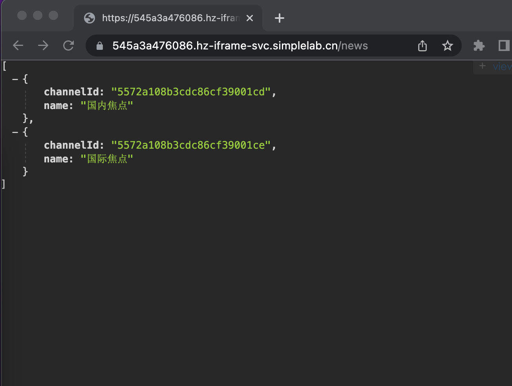

# 资讯接口

## 介绍

随着技术的发展，很多前端工程师已经不满足于只做诸如页面布局和交互这些开发工作了，很多人将目光逐渐转向了“大前端”范围，其中就包括不需要依赖后端提供接口自己就可以使用 node.js 编写一个后端接口服务。

下面就让我们也来使用 node.js 完成一个新闻资讯接口吧。

## 准备

本题已经内置了初始代码，打开实验环境，目录结构如下：

```txt
└── app.js
```

## 目标

1. 通过在 `app.js` 书写代码，创建一个服务器，使服务在 **8080** 端口运行。
2. 访问 `/news` 返回资讯数据，访问其他任意路径均返回**字符串 404** 。

| Url  | 请求方式 | 参数 |   响应结果   |
| :--: | :------: | :--: | :----------: |
| news |   GET    |  空  | 显示资讯数据 |

数据需要设置为 `utf8` 格式，资讯数据格式如下：

```json
[
  {
    "channelId": "5572a108b3cdc86cf39001cd",
    "name": "国内焦点"
  },
  {
    "channelId": "5572a108b3cdc86cf39001ce",
    "name": "国际焦点"
  }
]
```

设置 `utf8` 格式代码:

```js
res.setHeader("Content-type", "text/html;charset=utf8");
```

3. 通过 `node app.js` 运行代码，使服务处于运行状态，点击右侧 【web 服务】，页面上显示访问域名+'/news' 返回资讯数据。效果如下：



## 规定

- 请严格按照考试步骤操作，切勿修改考试默认提供项目中的文件名称、文件夹路径等。
- 满足题目需求后，保持 Web 服务处于可以正常访问状态，点击「提交检测」系统会自动判分

## 判分标准

- 本题完全实现题目目标得满分，否则得 0 分。
