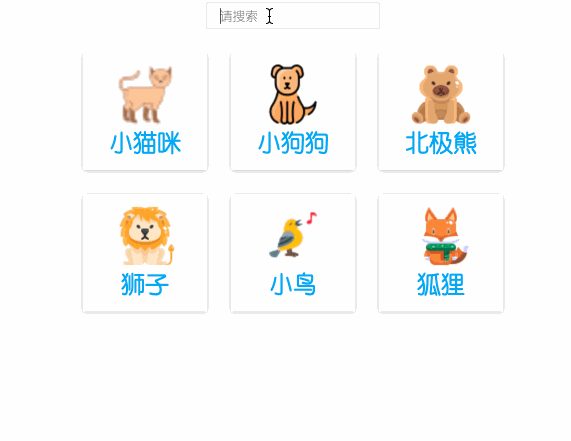

# 【功能实现】搜一搜呀

## 背景介绍

通常网站上会有搜索功能，方便用户定位搜索。本次试题我们要使用 Vue 2 的语法来完成一个关键字匹配的搜索功能。

## 准备步骤

在开始答题前，你需要在线上环境终端中键入以下命令，下载并解压所提供的文件。

```bash
wget https://labfile.oss.aliyuncs.com/courses/7835/exam02-imi.zip && unzip exam02-imi.zip && mv exam02-imi/* ./ && rm -rf exam02-imi*
```

下载完成之后的目录结构如下：

```txt
├── css
│   └── style.css
├── images
│   ├── bar.png
│   ├── birds.png
│   ├── cat.png
│   ├── dog.png
│   ├── fox.png
│   └── lion.png
├── index.html
└── vue.min.js
```

其中：

- `css/style.css` 是样式文件。
- `images` 是项目所用到的图片文件。
- `index.html` 是实现搜索功能的页面。
- `vue.min.js` 是 Vue 文件。

1. 下载源码。
2. 选中 `index.html` 右键启动 Web Server 服务（Open with Live Server），让项目运行起来。
3. 打开环境右侧的【Web 服务】，当前页面无法正常显示。

## 考试要求

<div class="alert alert-success">

请完善 `index.html` 文件，让页面具有如下所示的效果：



</div>

## 要求规定

- 请严格按照考试步骤操作，切勿修改考试默认提供项目中的文件名称、文件夹路径等。
- 满足题目需求后，保持 Web 服务处于可以正常访问状态，点击「提交检测」系统会自动判分。
