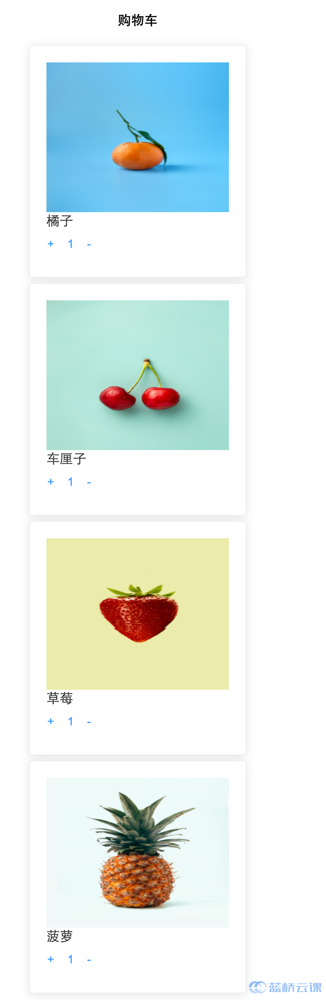

# 【功能实现】购物车

## 背景介绍

购物车是商城类应用里必不可少的功能，接下来，我们将使用 vue 实现一个购物车列表。

## 准备步骤

在开始答题前，你需要在线上环境终端中键入以下命令，下载并解压所提供的文件。

```bash
wget https://labfile.oss.aliyuncs.com/courses/7835/carlist.zip&& unzip carlist.zip && rm carlist.zip
```

下载完成之后的目录结构如下：

```txt
├── carList.json  # json 数据
├── css      #  样式文件夹
│   ├── element-ui.css
│   └── index.css
├── images   # 图片文件夹
│   ├── img1.jpg
│   ├── img2.jpg
│   ├── img3.jpg
│   └── img4.jpg
├── index.html
└── js    # 项目中用到的 js 文件
    ├── axios.js
    ├── element-ui.js
    └── vue.js
```

其中：

- `css` 存放项目样式。
- `js` 存放项目中用到的 js 文件。
- `images` 存放项目中用到的图片。
- `carList.json` 存放本次挑战需要请求的数据。
- `index.html` 是本次挑战需要完善的布局页面。

1. 选中 index.html 右键启动 Web Server 服务（Open with Live Server），让项目运行起来。
2. 打开环境右侧的【Web 服务】。


## 考试要求

<div class="alert alert-success">

在代码中需要修改的部分有相关提示，请仔细阅读，然后完善 `index.html` 中的 js 部分代码，请求数据，并让数据正确显示到页面上，完成后效果如下：



</div>

## 要求规定

- 请严格按照考试步骤操作，切勿修改考试默认提供项目中的文件名称、文件夹路径等。
- 满足题目需求后，保持 Web 服务处于可以正常访问状态，点击「提交检测」系统会自动判分。
