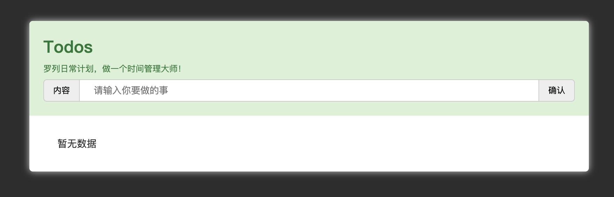

# 【功能实现】时间管理大师

## 背景介绍

时间管理永远都是提升工作和学习效率的必备法门，你在平时的工作学习中是否也有做计划和管理计划的习惯呢？

本题需要在已提供的基础项目中使用 Vue.js 知识实现一个简易的任务管理器。

## 步骤准备

在开始答题前，你需要在线上环境终端中键入以下命令，下载并解压所提供的文件。

```bash
wget https://labfile.oss.aliyuncs.com/courses/7835/exam13-imi.zip && unzip exam13-imi.zip && rm exam13-imi.zip
```

下载完成之后的目录结构如下：

```txt
├── css
│   └── style.css # 页面样式文件
├── img
│   └── icon.png # 页面所需小图标
├── index.html # 页面布局即逻辑编码文件
└── js
    └── vue.js # 版本为 2.x 的 Vue.js 框架
```

源码下载后，选中 `index.html` 右键启动 Web Server 服务（Open with Live Server），让项目运行起来。

接着，打开环境右侧的【Web 服务】，就可以在浏览器中看到如下效果：



当前显示仅有静态布局，并未实现具体功能。

## 考试要求

<div class="alert alert-success">

请在 `index.html` 文件中使用默认提供的 DOM 结构（即**基础项目提供的 DOM 结构和指定 id 不能改变**），使用 Vue 2.x 语法实现任务管理器功能。

具体需求如下：

1. 页面加载后默认显示 “暂无数据”。

最终实现效果如下：


2. 在输入框中输入内容并点击 “确认” 按钮后，将输入内容添加到任务列表。

最终实现效果如下：


3. 新增任务添加在已有任务后面。

最终实现效果如下：


4. 点击每条任务右侧的“删除”图标该任务会从任务列表中移除。

最终实现效果如下：


5. 底部 “总数” 右侧显示当前任务列表中的数量。

最终实现效果如下：


6. 点击底部的 “清除” 将清空任务列表中的数据，任务列表处恢复 “暂无数据” 的默认显示。

最终实现效果如下：


</div>

## 要求规定

- 请严格按照考试步骤操作，切勿修改考试默认提供项目中的文件名称、文件夹路径等。
- 满足题目需求后，保持 Web 服务处于可以正常访问状态，点击「提交检测」系统会自动判分。
