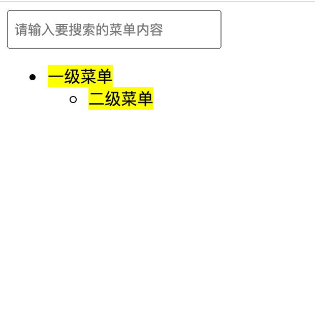
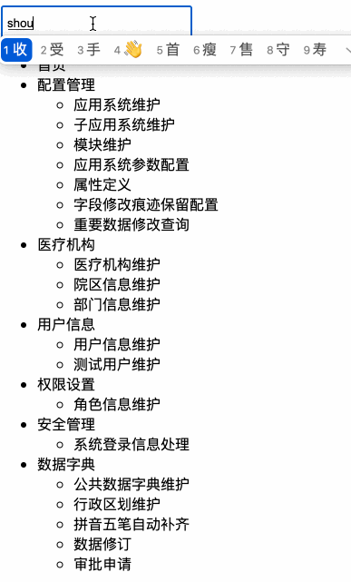

# 【功能实现】菜单树检索 

## 背景介绍

实际工作中很多前端攻城狮都会遇到这样一个需求：在多级菜单树中模糊搜索匹配的菜单项，并显示出来。

本题需要在已提供的基础项目中使用 Vue.js 知识，实现对已提供的二级菜单树的动态渲染及模糊搜索功能，最终将符合搜索要求的二级菜单树显示在页面中。

## 步骤准备

在开始答题前，你需要在线上环境终端中键入以下命令，下载并解压所提供的文件。

```bash
wget https://labfile.oss.aliyuncs.com/courses/7835/exam11-imi.zip && unzip exam11-imi.zip && rm exam11-imi.zip
```

下载完成之后的目录结构如下：

```txt
├── data.json # 二级菜单总数据
├── index.html # 页面布局
└── js
    ├── axios.min.js # 用于异步获取数据的 Ajax 封装库
    ├── index.js # 页面功能实现的逻辑代码
    └── vue.js # 版本为 2.x 的 Vue.js 框架
```

源码下载后，选中 `index.html` 右键启动 Web Server 服务（Open with Live Server），让项目运行起来。

接着，打开环境右侧的【Web 服务】，就可以在浏览器中看到如下效果：



当前显示仅有静态布局，并未实现二级菜单数据的异步获取与显示以及模糊搜索功能。

## 考试要求

<div class="alert alert-success">

请在 `index.js` 和 `index.html` 文件中根据现有 DOM 结构（基础项目提供的 **DOM 结构和 id、选择器**等**不要做修改**）实现二级菜单数据异步获取（使用 axios）和搜索功能（使用 Vue 2.x 语法）。

具体需求如下：

页面加载后输入框内容为空，页面显示异步获取二级菜单的所有数据；输入待查找的字段后，页面中显示包含该字段的所有菜单数据，并将包含该搜索内容的菜单数据标记为黄色背景，具体表现如下：

1. 若该菜单有父级菜单，则返回其父级菜单及同胞菜单。
2. 若该菜单有子级菜单，则返回该菜单及其下子级菜单。
3. 若该菜单既无父级也无子级，则返回菜单本身即可。
4. 推荐测试字段：查询、首页、管理、配置、维护。

最终实现效果如下：



</div>

## 要求规定

- 请严格按照考试步骤操作，切勿修改考试默认提供项目中的文件名称、文件夹路径等。
- 满足题目需求后，保持 Web 服务处于可以正常访问状态，点击「提交检测」系统会自动判分。
