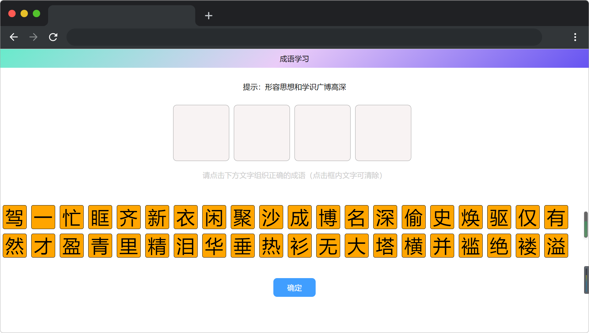
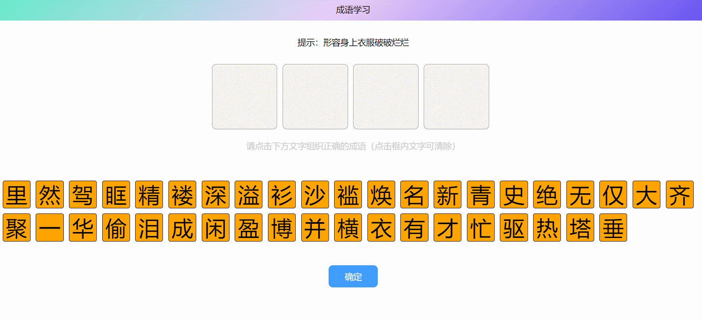

# 成语学习

## 介绍

小楼的爸爸是一名程序员，暑假期间，发现小楼在家经常玩手机，于是决定设计一个小游戏让小楼学习成语来加强小楼对成语的理解。

接下来让我们跟着小楼来学学成语吧~

## 准备

本题已经内置了初始代码，打开实验环境，目录结构如下：

```txt
├── index.html
└── js
    └── vue.min.js
```

选中 `index.html` 右键启动 Web Server 服务（Open with Live Server），让项目运行起来。

接着，打开环境右侧的【Web 服务】，就可以在浏览器中看到如下效果：



## 目标

完善 `index.html` 中的 `confirm` 方法和 `getSingleWord` 方法。

1. `getSingleWord` 方法：点击文字后，在变量 `idiom` 从左到右第一个空的位置加上该文字。

示例一：

```txt
idiom=["","","",""]，点击热字，则idiom=["热","","",""]
```

示例二：

```txt
idiom=["热","","","眶"]，点击泪字，则idiom=["热","泪","","眶"]
```

示例三：

```txt
idiom=["热","泪","盈","眶"]，点击任何字，则idiom=["热","泪","盈","眶"]
```

2. `confirm` 方法需要校验成语是否输入正确答案，猜中成语 `result` 为 `true` ；猜错成语 `result` 为 `false`。

示例一：

```txt
tip='形容非常感激或高兴'，idiom=["热","泪","盈","眶"]，则result返回true
```

示例二：

```txt
tip='形容非常感激或高兴'，idiom=["泪","眼","盈","眶"]，则result返回false
```

示例三：

```txt
tip='在繁忙中抽出空闲来'，idiom=["忙","里","偷","闲"]，则result返回true
```

完成后，最终页面效果如下：



## 规定

请按照给出的步骤操作，切勿修改默认提供的文件名称、文件夹路径、函数名等。

## 判分标准

- 本题完全实现题目目标得满分，否则得 0 分。
