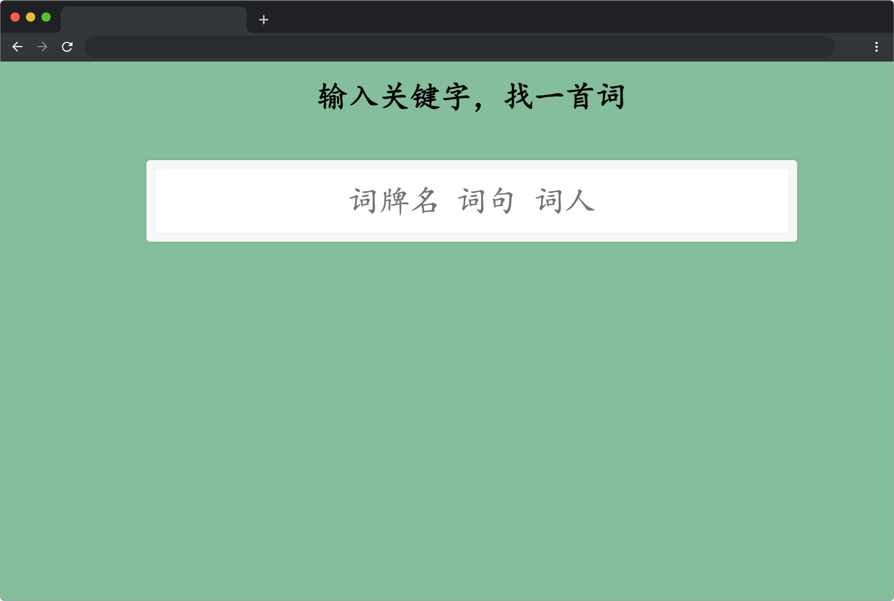
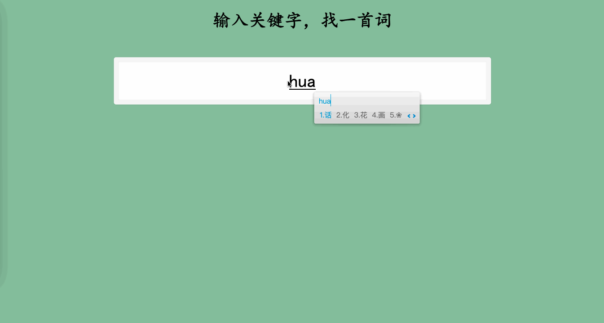

# 绝美宋词

## 介绍

“今宵酒醒何处，杨柳岸晓风残月”，“蓦然回首，那人却在灯火阑珊处”，“试问闲愁都几许？一川烟草，满城风絮，梅子黄时雨” ......

宋词可谓是古代文学桂冠上一颗璀璨的明珠，本题将实现一个在搜索框中输入关键字，实时显示符合条件的完整宋词的功能。

## 准备

本题已经内置了初始代码，打开实验环境，目录结构如下：

```txt
├── css
│   └── style.css
├── data.json
├── index.html
└── js
    ├── axios.min.js
    └── vue.min.js
```

其中：

- `index.html` 是主页面。
- `js/vue.min.js` 是项目用到的 vue2.x 版本文件。
- `js/axios.min.js` 是 axios 文件。
- `data.json` 是项目中需要用到宋词数据。
- `css/style.css` 是样式文件。

选中 `index.html` 右键启动 Web Server 服务（Open with Live Server），让项目运行起来。

接着，打开环境右侧的【Web 服务】，就可以在浏览器中看到如下效果：



## 目标

请使用 Vue ，完成 `index.html` 文件中的 TODO 部分。

1. 完成数据请求（数据来源 `./data.json`），`data.json` 是宋词数据，`poetry_content` 表示词句，`title` 表示词牌名，`author` 表示词人。
2. 在输入框输入关键词时在 `ul`（`class = suggestions`）的元素中**实时显示**词牌名、词句、词人中包含关键词的**完整词句（包含词牌名、词人）列表**，当关键词为空或者匹配不到时 `ul`（`class = suggestions`）元素的子节点为空。完整词句的 DOM 结构按照如下规定显示：

```html
<!-- 每一首完整词句用一个 li 包裹 -->
<li>
  <span class="poet">词句</span>
  <span class="title">词牌名 - 词人</span>
</li>
```

例：

```html
<li>
  <span class="poet"
    >常记溪亭日暮，沉醉不知归路。兴尽晚回舟，误入藕花深处。争渡，争渡，惊起一滩鸥鹭</span
  >
  <span class="title">如梦令 - 李清照</span>
</li>
```

3. 高亮匹配到的所有词句中的关键词。即使用 `<span class="highlight"></span>` 标签包裹所有关键词。

例：(关键词：雨)

```html
<li>
  <span class="poet"
    >寒蝉凄切，对长亭晚，骤<span class="highlight">雨</span
    >初歇。都门帐饮无绪，方留恋处，兰舟催发。执手相看泪眼，竟无语凝噎。念去去千里烟波，暮霭沉沉楚天阔。多情自古伤离别，更那堪冷落清秋节。今宵酒醒何处，杨柳岸晓风残月。此去经年，应是良辰美景虚设。便纵有千种风情，更与何人说</span
  >
  <span class="title"><span class="highlight">雨</span>霖铃 - 柳永</span>
</li>
```

> **注意**：**本题要求的是实时显示，即输入完成的同时显示结果，非失去焦点显示**。

完成后，最终页面效果如下：



## 规定

- 请勿修改已经提供的代码，以免造成判题无法通过。
- 请严格按照考试步骤操作，切勿修改考试默认提供项目中的文件名称、文件夹路径等。
- 满足题目需求后，保持 Web 服务处于可以正常访问状态，点击「提交检测」系统会自动判分

## 判分标准

- 本题完全实现题目目标得满分，否则得 0 分。
