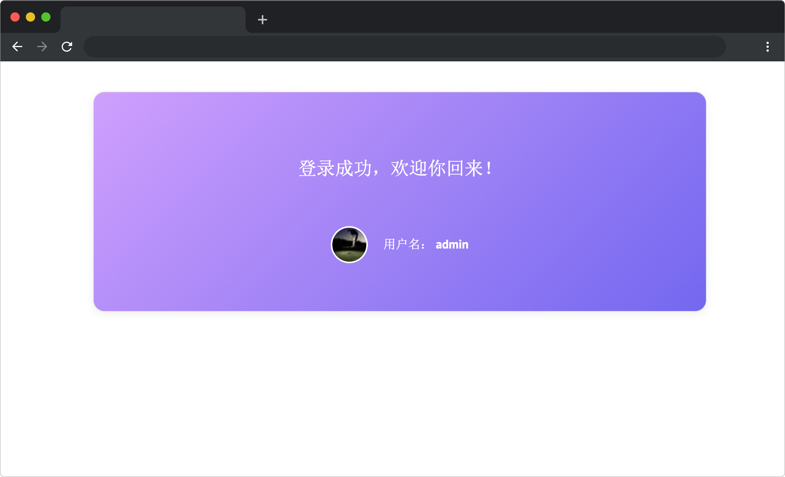

# 消失的 Token

## 介绍

小蓝开发了一个登录功能，但是在登录界面中输入用户名后点击“确认”按钮并没有如预期般成功进入欢迎界面。但是从出现欢迎语来看，数据已经发生了改变，到底是怎么回事呢？请帮助小蓝排查代码，让登录功能回归正常吧！

## 准备

目录结构如下：

```bash
├── components
│   ├── login.js
│   └── panel.js
├── css
│   └── style.css
├── index.html
├── lib
│   ├── vue.min.js
│   └── vuex.min.js
└── store
    ├── BaseModule.js
    ├── UserModule.js
    └── index.js 
```

其中：

- `index.html` 是主页面。
- `components` 是为示例组件文件夹。
- `lib` 是存放项目相关依赖的文件夹。
- `store` 是 Vuex 状态管理文件夹。
- `css` 是存放项目样式的文件夹。

注意：打开环境后发现缺少项目代码，请复制下述命令至命令行进行下载。

```bash
cd /home/project
wget https://labfile.oss.aliyuncs.com/courses/18164/dist_03.zip
unzip dist_03.zip
mv dist/* ./
rm -rf dist*
```

在浏览器中预览 `index.html` 页面效果如下：



此时输入用户名后回车/点击确定，数据发生改变，但还是停留在登录页，无法正确显示登录成功界面。

## 目标

找到 `index.html` 中的 `TODO` 部分，仔细阅读 `store` 文件夹下的相关代码并结合 `Vuex` 相关知识，排查代码中存在的问题，修改后使得登录界面输入 admin 时，点击确认按钮/回车可以正确显示如下界面：


## 规定

- 请按照给出的步骤操作，切勿修改默认提供的文件名称、文件夹路径等。
- 满足需求后，保持 Web 服务处于可以正常访问状态，点击「提交检测」系统会自动检测。


## 判分标准

- 本题完全实现题目目标得满分，否则得 0 分。